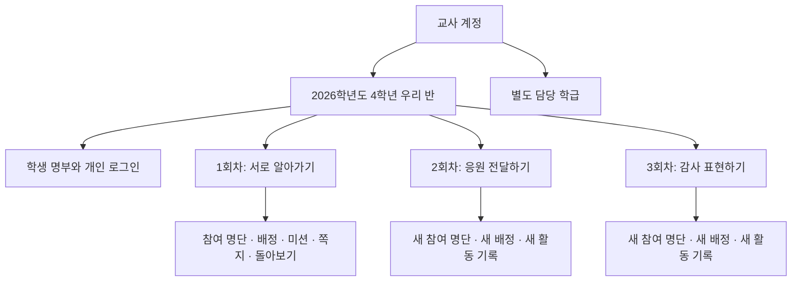
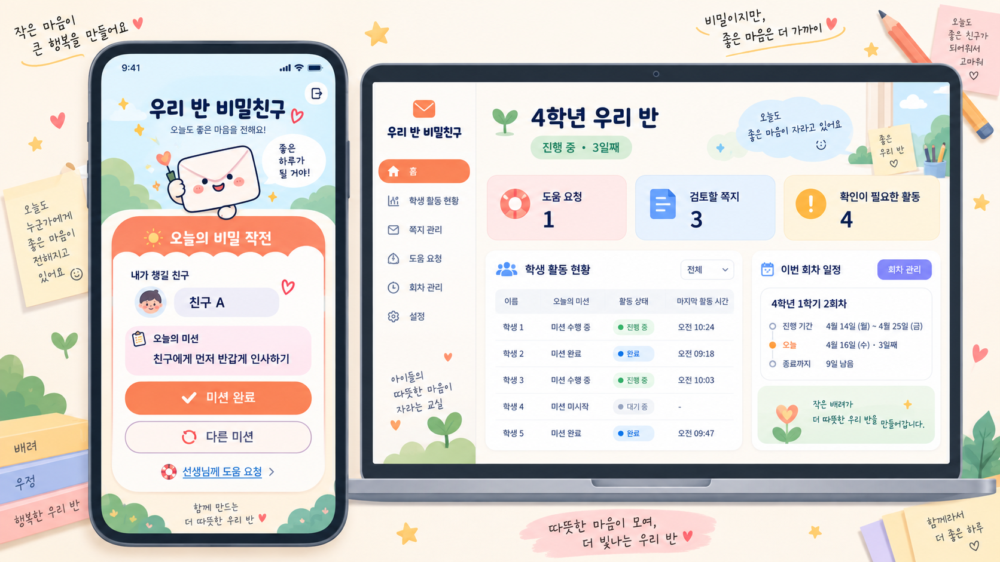

# 초등학교 마니또 서비스 개발 계획서

**가칭: 우리 반 비밀친구**  
**문서 버전:** 2.1 · **최초 작성일:** 2026년 9월 18일 · **개정일:** 2026년 9월 27일

**대상:** 대한민국 초등학교 교사와 초등학교 1~6학년 학생  
**확정 조건:** 교사 방장서비스 / 학생 회원서비스 분리, 여러 회차 운영, Firebase 백엔드, 귀엽고 장난스러운 디자인

> 교사는 학급의 배려 활동을 쉽게 운영하고, 학생은 새로운 친구를 챙기는 작은 실천을 반복하는 서비스로 개발한다. 학급은 유지하고, 참여 명단·매칭·미션·쪽지·돌아보기는 회차별로 분리한다.

이 문서는 후속 개발의 기준이 되는 실행 계획서다. 지금까지의 기획, 백엔드 구현·배포, 대표 UI 시안을 통합했다. **2026-09-27 현재 D1 웹·백엔드는 개발 환경에 배포했고, D2~D5의 회차·활동 기능은 로컬에서 구현·가상 학급 두 회차 검증을 마쳤다.** 개발 클라우드 배포와 교사 Google 로그인 검증, 실제 학생 도입 정책은 별도 완료 조건이다. 숫자로 제시한 운영 기본값과 일정은 구현·시범 운영을 위한 기준이며 검증 후 조정한다.

## 0. 이번 개정의 기준과 현재 상태

### 0.1 기록과 구현의 구분

| 구분 | 2026-09-27 기준 확인 내용 | 다음 개발에서 할 일 |
|---|---|---|
| 제품 기획 | 교사·학생 분리, 학급 유지·회차 반복, 안전 운영 원칙 수립 | 화면·서버에 정책을 일관되게 구현 |
| Firestore | 경로·타입·Rules·복합 인덱스 5개 작성, 개발 프로젝트 배포 기록 있음 | 새 기능별 데이터 계약·권한·쿼리 검증 |
| 계정·학급 함수 | `createClass`, `registerStudents`, `loginStudent`, `rotateStudentCredential` 구현·배포 | 웹 연결, 승인·차단·복구 흐름과 보안 보강 |
| 자동 검증 | 기존 기록: 빌드, 단위 4개·Rules 8개·통합 1개 통과 | 기능 추가 시 회귀 검증; 브라우저와 실개발환경 검증 추가 |
| UI | 학생 홈·교사 대시보드의 이미지 시안 및 디자인 설명 | 컴포넌트, 반응형, 접근성, 실제 데이터 연결 |
| 미구현 | 프런트엔드, 교사 승인 도구, 학생 홈 조회, 회차·매칭, 미션, 쪽지·도움, 공개·회고·삭제, 웹 배포 | 아래 D1~D6 단계로 구현 |
| 미검증 | 배포된 함수의 웹 Custom Token 인증 전체 흐름 | 가상 계정으로 클라우드 통합 확인 |

배포·테스트 완료 표기는 기존 작업일지와 코드 기준이다. 이번 문서 개정에서 클라우드 설정을 다시 조회하거나 서비스를 재배포한 것은 아니다. Rules·타입에 경로가 있다고 해당 기능이 구현된 것으로 계산하지 않는다.

**2026-09-27 개발 착수 기록:** 위 표는 v2.0 작성 당시 기준이다. 이후 D1 첫 입장 웹과 B-01~03·05 보강을 로컬에 구현해 빌드·Emulator 테스트와 학생 브라우저 흐름을 확인했다. Firebase 개발 클라우드와 웹 배포는 아직 갱신하지 않았다. 사용자 결정에 따라 웹 배포 대상을 Vercel로 변경했다. 세부 결과는 작업일지의 최신 항목을 따른다.

**2026-09-27 배포 진행 기록:** D1 코드를 GitHub `main`에 푸시하고 함수 9개와 Firestore Rules·인덱스를 개발 Firebase에 배포했다. 개발 웹 앱을 등록했다. Vercel `manito` 프로젝트의 첫 빌드는 루트 설정 오류로 실패했고 루트를 수정했다. 웹 배포 성공과 개발 클라우드의 인증 흐름 검증은 아직 남아 있다. 세부 결과는 작업일지의 최신 항목을 따른다.

**2026-09-27 보안 설정 결정:** 사용자의 요청에 따라 App Check와 reCAPTCHA 의존성을 제거했다. 서비스의 사용자 수만으로 악용 가능성을 판단하지 않고, 교사·학생 인증과 함수의 권한 검사, Firestore Rules, 카드 실패 잠금, 요청 멱등성을 유지한다. 공개 웹 도입 전 가상 계정으로 로그인·권한·비용 흐름을 확인한다.

**2026-09-27 웹 배포 기록:** App Check 제거 후 개발 Firebase 함수 9개를 다시 배포했고, Vercel 웹 배포가 Ready 상태가 됐다. 학생·교사 화면과 가상 카드 오류 응답을 확인했다. 교사 Google 로그인과 실제 카드의 개발 클라우드 인증은 아직 미검증이다.

**2026-09-27 D2~D5 로컬 구현 기록:** 회차·서버 매칭·미션 30개·쪽지 검토·도움 요청·공개·회고·설정 복사·학급 삭제를 구현했다. 가상 학생 4명으로 두 회차를 운영하고 삭제까지 검사했으며 함수 단위·Rules·통합 테스트를 통과했다. 배포와 클라우드 인증·실제 학생 정책은 작업일지의 최신 기록으로 구분한다. 위 0.1 표는 v2.0 작성 당시 기준을 보존한다.

**2026-09-27 D2~D5 개발 백엔드 배포:** Firebase `manito-938cc`에 함수 33개와 Firestore Rules·인덱스를 배포했다. 웹 최신 버전은 GitHub 푸시 후 Vercel 상태를 별도로 확인한다. 클라우드 교사 Google 로그인과 가상 카드 전체 흐름 검증은 남아 있다.

**2026-09-27 D6 보강 진행:** 지난 회차 기록 조회와 보관 중 도움 요청, 교사용 안전 원문 열람·비공개 접속 상태, 종료 전 일시정지 회차 기간 연장, 쪽지 1회 반응, 학생 정보 열람·정정·삭제 요청 접수와 교사 조회를 구현했다. 가상 학생 4명의 두 회차와 40명 회차 통합 시험을 통과했다. 개별 정보 정정·삭제 실행, 백업 처리 및 학교 운영 절차는 아직 결정·구현되지 않았다. 배포 상태는 작업일지 최신 항목을 따른다.

**2026-09-27 교사 인증과 개인정보 준비:** Firebase Google 제공업체와 Vercel 허용 도메인을 설정했고, 배포 웹에서 Google 로그인 뒤 승인 대기 상태를 확인했다. 관리자 승인 뒤 개발 클라우드의 학급·가상 카드 전체 흐름은 별도로 검증한다. 개인정보 처리방침은 `docs/privacy-policy-draft.md`에 코드 기준 초안을 작성했다. 운영 주체, 연락처, 처리 근거, 보유 기간, 위탁·국외 이전, 권리 처리 절차가 확정되기 전에는 정식 방침으로 공개하거나 실제 학생 정보를 입력하지 않는다. 개발 웹에는 이 점을 안내한다.

**2026-09-27 개발 클라우드 인증 검증 진행:** 확인된 가상 교사를 승인하고 Vercel 웹에서 가상 학급 생성, 네 명의 학생 카드 발급, 회차 준비·시작까지 확인했다. 실제 카드로 학생 로그인을 시도하자 `loginStudent` 실행 계정의 `iam.serviceAccounts.signBlob` 권한 부족으로 500이 반환됐다. Custom Token 서명 권한을 해당 서비스 계정에 한정해 설정한 뒤 학생 로그인부터 두 회차 흐름을 다시 확인한다. 실제 학생 정보는 사용하지 않았다.

**2026-09-27 개발 클라우드 두 회차 검증:** 실행 계정의 서명 권한이 적용돼 가상 카드 로그인에 성공했다. 배포 웹에서 첫 회차 매칭 4건, 미션 완료·교체·쉬기, 도움 요청·처리, 공개 승인 전 비공개와 승인 후 감사·회고, 첫 회차 보관과 두 번째 회차 설정 복사·새 배정·공개·보관까지 확인했다. 학생 새 소식에서 공개 상태가 갱신되지 않는 화면 결함을 수정했다. 로컬 Rules 11개, 함수 단위 10개, 계정·두 회차·40명 통합 3개를 다시 통과했다. 실제 학생 정보 사용 전 개인정보·권리 처리와 운영 환경 분리는 여전히 필요하다.

### 0.2 저장소와 환경

- GitHub: [moodoocoding/260918_manito](https://github.com/moodoocoding/260918_manito), 기본 브랜치 `main`.
- 개발 Firebase: 표시 이름 `260918 manito`, 프로젝트 ID `manito-938cc`, 별칭 `dev`.
- Firestore: `(default)`, Native mode Standard, 서울 `asia-northeast3`, 삭제 방지 활성화 기록.
- Functions: Node.js 22, 2세대, 서울 `asia-northeast3`. 컨테이너 이미지 보관 정책 30일.
- 로컬: `demo-manitto` Emulator. 실제 학생 데이터를 사용하지 않는다.
- 운영: 별도 운영 프로젝트는 아직 마련하지 않았다. Vercel 개발 웹사이트는 배포됐고 Firebase 개발 프로젝트와 연결된다.

### 0.3 문서 사용 순서와 개정 범위

제품 요구사항은 이 문서, 실제 경로는 [Firestore 데이터 계약](./firestore-schema.md), 기존 함수 입출력은 [Functions API](./functions-api.md)를 기준으로 한다. 작업 지침은 [AGENTS.md](../AGENTS.md), 이력은 [작업일지](./work-log.md), 배포 절차는 [배포 가이드](./firebase-deployment.md)에 기록한다.

v2에서는 현재 구현 상태를 바로잡고, [대표 UI 시안](./ui-concept.md)의 적용 기준, 화면별 오류·빈 상태, 인증 선행 작업, 기능별 개발 묶음과 통과 기준을 추가했다. 새로운 함수명·필드는 **계획안**이며 구현 직전에 API·데이터 계약을 갱신한다. 이번 작업 범위는 문서 정비이며 실제 기능 개발은 후속 단계에서 시작한다.

## 1. 서비스 정의와 목표

### 1.1 서비스 한 문장

**초등학교 교사가 학급별 마니또 활동을 개설하고, 학생들이 비밀친구를 위한 미션과 응원 쪽지를 주고받으며, 활동을 돌아본 뒤 다음 회차를 이어가는 학급 활동 웹서비스.**

여러 학교의 여러 교사가 독립적으로 이용할 수 있다. 각 학급의 명부, 배정, 쪽지와 기록은 다른 학급에서 볼 수 없다. 학생은 담당 교사가 준비한 학급에만 들어온다.

### 1.2 해결할 문제

| 사용자 | 예상되는 문제 · 검증할 가설 | 제공할 가치 |
|---|---|---|
| 교사 | 종이 추첨, 명단 변경, 활동 안내, 결과 공개를 따로 준비해야 한다 | 학급 등록 후 회차 설정·배정·미션·마무리를 한곳에서 운영 |
| 교사 | 누가 도움이 필요한지 파악하기 어렵다 | 미접속·도움 요청·검토 대기 쪽지를 비공개 운영 화면에서 확인 |
| 학생 | 상대를 뽑아도 무엇을 해야 할지 막막하다 | 교실에서 실천할 수 있는 짧고 구체적인 미션 제공 |
| 학생 | 편지를 못 받거나 미션을 못 하면 소외감이나 부담을 느낄 수 있다 | 경쟁 없는 참여, 대체 미션, 교사 도움 요청, 수신 공백 확인 |
| 교사·학생 | 다시 진행할 때 설정과 가입을 반복하거나 같은 상대가 계속 나올 수 있다 | 학생 계정 유지, 회차 복사, 과거 배정 중복 최소화 |

### 1.3 제품 원칙

1. **실제 교실에서의 행동이 중심이다.** 웹은 상대 확인·미션 안내·응원·돌아보기를 돕는다.
2. **학생끼리의 비밀과 교사의 보호 책임을 함께 설계한다.** 교사는 필요할 때 발신자와 내용을 확인할 수 있다.
3. **한 번의 활동은 짧게, 재운영은 쉽게 한다.** 첫 회차부터 다음 회차 개설까지를 핵심 기능으로 본다.
4. **참여의 속도와 방식에 선택권을 준다.** 미션 교체·쉬기·도움 요청에 감점이나 공개 표시를 붙이지 않는다.
5. **돈과 개인 기기에 의존하지 않는다.** 선물 구매나 개인 스마트폰을 필수로 요구하지 않는다.
6. **배려를 점수로 평가하지 않는다.** 완료 횟수를 학생의 인성·친구 관계·생활기록부 평가로 환산하지 않는다.

## 2. 웹 조사와 기획에 반영한 내용

자료 확인일은 2026년 9월 18일이다. **자료에서 확인한 운영 사실**과 **이 서비스에 적용할 기획 판단**을 구분했다. 아래 사례만으로 마니또가 학교폭력을 줄이거나 관계를 개선한다고 인과적으로 단정하지 않는다.

| 조사 대상 | 확인한 내용 | 기획 반영 |
|---|---|---|
| 국립국어원 온라인가나다, 2025.12.30 답변 | 제비뽑기 등으로 정해진 상대에게 정체를 숨기고 편지·선행 등을 제공하는 비밀친구 개념을 설명한다 | 추첨, 비밀 유지, 상대를 위한 행동을 핵심 경험으로 유지한다. 학생에게는 ‘내가 챙겨줄 친구’와 ‘나를 챙겨주는 친구’를 구분해 안내한다. [원문](https://www.korean.go.kr/front/onlineQna/onlineQnaView.do?mn_id=216&pageIndex=1&qna_seq=325667) |
| 울산교육청, 울산중앙초 친구사랑주간, 2025.07.14 | 7월 7~11일 활동에 우정 다짐, 인사·칭찬, 마니또, 편지쓰기, 공동 활동 등을 연결했다 | 한 회차를 ‘시작 약속 → 작은 실천 → 응원 → 돌아보기’로 구성하고 5일 운영 템플릿을 제공한다. [원문](https://use.go.kr/news/user/bbs/BD_selectBbs.do?q_bbsDocNo=20250714172606585&q_bbsSn=1006) |
| 함안교육지원청, 칠원초 학생회 활동, 2022.07.27 | 학생회가 학생 의견을 반영해 행사를 운영했고, 7월 친구사랑주간에 비밀친구 미션을 진행했다 | 교사가 안전한 미션을 고르고, 향후 고학년 학생의 미션 제안 기능을 추가한다. 이 사례가 매월 마니또를 했다는 뜻은 아니다. [원문](https://hmedu.gne.go.kr/hmedu/na/ntt/selectNttInfo.do?mi=4645&nttSn=2440083) |
| CASEL, Explicit SEL Instruction | 발달 단계에 맞는 학습, 실천, 성찰 기회와 명확한 목표를 가진 활동 설계를 제시한다 | 학년군별 문장 난이도와 회고 방식을 달리한다. 반복 운영의 교육 설계 참고이며 마니또 자체의 효과 검증 자료는 아니다. [원문](https://schoolguide.casel.org/focus-area-3/classroom/explicit-sel-instruction/) |
| 기존 ‘마니또(manito)’ 앱의 개발자 등록 설명 | 방·초대 코드·자동 매칭·미션·사진과 글 기록·결과 공개 기능을 안내한다 | 기본 추첨 기능에 더해 교사 운영, 학급 단위 반복 활동, 공용기기, 아동 보호를 차별점으로 삼는다. 초등학생용으로 사진 인증이나 공개 피드를 그대로 도입하지 않는다. 직접 사용성 검증을 한 것은 아니다. [앱 설명](https://apps.apple.com/kr/app/%EB%A7%88%EB%8B%88%EB%98%90-manito/id6744556011) |

표기는 사용자에게 익숙한 ‘마니또’를 제품 용어로 사용한다. 어원이나 외국어 기원은 서비스 소개에 넣지 않는다.

### 2.1 디지털 특성을 살리는 방식

| 기존 활동의 요소 | 디지털로 제공할 기능 | 운영상 주의할 점 |
|---|---|---|
| 종이 제비뽑기 | 서버 자동 배정, 학생별 봉투 열기 | 전체 배정표를 학생 브라우저에 보내지 않음 |
| 비밀친구 기억하기 | 개인 화면에서 상대 다시 확인 | 공용기기에서 다음 학생에게 화면이 남지 않음 |
| 활동을 스스로 떠올리기 | 학년·회차 주제에 맞는 미션 | 미션이 숙제처럼 쌓이지 않음 |
| 몰래 편지 전하기 | 교사가 중재할 수 있는 개인 우편함 | 발신자 숨김은 학생 간에만 적용 |
| 다음 행사 재준비 | 학급 유지, 회차 복사, 과거 배정 참조 | 지난 회차의 쪽지·기록은 새 회차로 복사하지 않음 |
| 마지막 날 발표 | 교사 승인 후 개인별 정체 공개와 감사 | 전체 관계망·쪽지를 학급 화면에 공개하지 않음 |

## 3. 사용자와 이용 환경

### 3.1 방장: 초등학교 교사

- 여러 학급 또는 담당 활동을 관리할 수 있다.
- PC에서 준비·확인을 하고, 태블릿에서도 급한 조치를 할 수 있어야 한다.
- 학생 등록, 로그인 복구, 미션 선택, 안전 조치, 공개 시점을 책임진다.
- MVP에서는 학급당 담당 교사 1명을 둔다. 공동 교사와 교사 간 인수인계는 후속 범위다.
- 교사는 학생 매칭에 참여하지 않는다.

### 3.2 회원: 초등학교 학생

여기서 회원은 이메일 가입을 한 일반 회원이 아니라, **교사가 학급 안에 등록한 학생 참여 계정**이다. 학생에게 이메일·휴대전화·SNS 계정을 요구하지 않는다.

| 학년군 | 기본 이용 방식 | 미션·쪽지·회고 방식 |
|---|---|---|
| 1~2학년 | 교사가 접속을 돕고 공용기기를 순서대로 사용 | 그림과 짧은 문장, 선택형 응원, 표정 선택 회고 |
| 3~4학년 | 학교 태블릿·PC에서 간단한 안내를 보고 사용 | 행동 미션, 문장 틀을 이용한 짧은 쪽지, 선택형 회고 |
| 5~6학년 | 본인 화면에서 자율적으로 확인 | 구체적 칭찬·경청·배려 미션, 교사 검토를 거친 자유 쪽지, 한 줄 회고 |

학년군 구분은 초기 UX 가설이다. 같은 학년에서도 읽기·쓰기·기기 사용 능력에 맞춰 교사가 쉬운 모드를 선택할 수 있다.

### 3.3 서비스 경계

- 학교 밖 낯선 사람과의 매칭, 학급 검색, 학생끼리의 방 개설은 제공하지 않는다.
- 다른 학급 학생에게 연락하거나 프로필을 검색할 수 없다.
- 학부모는 개인정보 안내·동의·권리 행사 절차의 대상이 될 수 있지만, MVP의 별도 활동 회원서비스는 아니다.
- 운영자용 교사 확인·장애 대응 도구는 내부 관리 기능이며, 교사 방장서비스와 구분한다.

## 4. 반복 운영을 위한 기본 구조

### 4.1 학급과 회차의 분리

| 단위 | 유지하는 정보 | 수명·규칙 |
|---|---|---|
| 교사 계정 | 교사 인증, 관리 학급 | 계정 단위 |
| 학급 | 학년도, 학년군, 학생 명부, 기본 설정 | 원칙적으로 한 학년도 단위 |
| 학생 참여 계정 | 학급 내 고정 식별자, 표시 이름, 로그인 자격 | 같은 학급의 여러 회차에서 유지 |
| 회차 | 주제, 일정, 확정 참여자, 배정, 미션, 쪽지, 회고 | 새 활동마다 새 ID 생성 |
| 배정 이력 | 누가 누구를 챙겼는지의 최소 기록 | 보관 중인 같은 학급의 회차에서만 참조 |

**예시:** 9월 ‘인사 작전’을 마친 뒤 교사가 ‘다음 작전 만들기’를 누른다. 학급과 학생 로그인은 유지된다. 10월 날짜와 주제를 고르고 참여자를 확인하면 새 회차가 준비된다. 지난 쪽지와 완료 도장은 지난 회차에만 남는다.

### 4.2 초기 운영 기본값

| 항목 | 제안값 |
|---|---|
| 한 학급의 참여 규모 | 회차당 4~40명. 소규모 학급의 2~3명 모드는 후속 검토 |
| 학급 내 동시 활동 | 진행·일시정지·공개 대기 회차를 합쳐 1개. 다음 회차 초안은 준비 가능 |
| 회차 기간 | 기본 5수업일, 선택 10수업일 |
| 미션 빈도 | 5수업일에 기본 3개. 교사가 활동일을 직접 지정 |
| 주말·공휴일 | 자동 미션 배정 없음. 학교 일정에 맞춰 교사가 제외 날짜 확인 |
| 재운영 간격 | 월 1회 등 교사가 선택. 자동 재개설하지 않음 |
| 정체 공개 | 활동 종료 후 교사가 확인하고 공개 |
| 쪽지 | 선택형 즉시 전달, 자유 입력은 교사 허용 및 사전 검토 |

최소 인원은 비밀친구를 유추하기 쉬운 초소규모 운영을 별도로 검토하기 위한 제품 범위다. 지원 인원에서도 학생의 행동이나 대화로 정체가 추측될 수 있으므로 완벽한 익명성을 보장한다고 안내하지 않는다.

### 4.3 회차 상태

| 상태 | 교사가 하는 일 | 학생에게 보이는 것 |
|---|---|---|
| 준비 중 | 일정·미션·학생 명단·배정 제외 조건 편집 | ‘선생님이 준비하고 있어요’ |
| 시작 준비 완료 | 참가자와 개인정보 처리 준비 여부 최종 확인 | 참여 안내와 활동 약속 |
| 진행 중 | 시작 시 배정 확정, 활동·도움 요청 확인 | 내 상대, 미션, 우편함 |
| 일시정지 | 사유 확인, 필요 시 기간 조정 또는 취소 | 기존 내용을 읽을 수 있으나 새 미션·쪽지 제출은 중지. 도움 요청·신고는 가능 |
| 공개 대기 | 종료 후 미전달 쪽지·안전 사안 확인 | 활동 종료 안내, 지난 활동 확인 |
| 공개 완료 | 개인별 정체 공개, 감사·회고 안내 | 나를 챙긴 친구, 감사 카드, 돌아보기 |
| 보관 | 회차를 읽기 전용으로 보관, 다음 회차 개설 | 보관 기간 내 본인 추억 보기 |
| 취소 | 취소 안내, 후속 활동 선택 | 취소 안내. 취소만으로 정체를 공개하지 않음 |

활동 종료 시각이 지나면 서버는 새 미션 제출·새 쪽지 전송을 막는다. 예약 작업이 늦게 실행되거나 학생이 기기 시간을 바꿔도 규칙은 유지한다. 다음 회차 시작은 이전 회차를 공개 완료·보관 또는 취소한 뒤 허용한다.

도움 요청·신고·본인 화면에서 쪽지 숨김·로그아웃은 일시정지·종료·보관 상태에서도 해당 기록에 대한 접근 자격이 있는 동안 허용한다. 계정 접근을 철회한 학생·보호자에게는 별도의 운영 문의·권리 요청 경로를 제공한다.

### 4.4 구현할 상태 전이와 허용 동작

아래 코드값은 현재 `RoundStatus` 타입과 맞춘다. 상태 변경 함수는 아직 구현하지 않았다.

| 코드 | 허용하는 다음 상태 | 업무 규칙 |
|---|---|---|
| `draft` | `ready`, `cancelled` | 명단·일정·미션을 편집 |
| `ready` | `draft`, `active`, `cancelled` | 수정하면 준비를 해제; 시작 시 교사 권한·명단 버전·학급 잠금 재검사 |
| `active` | `paused`, `reveal_pending`, `cancelled` | 기간 안의 미션·쪽지만 접수; 종료 시 새 제출 차단 |
| `paused` | `active`, `reveal_pending`, `cancelled` | 새 활동·쪽지 승인 중지; 종료 시각을 넘기면 공개 대기로 처리 |
| `reveal_pending` | `revealed`, `cancelled` | 새 미션·쪽지 불가; 접수된 쪽지 검토 가능; 안전 사안 처리 후 수동 공개 |
| `revealed` | `archived` | 활성 공개 관계에 한해 감사 카드·회고 허용; 매칭 변경 불가 |
| `archived` | 없음 | 읽기 전용; 도움·신고·숨김·삭제 요청은 자격에 따라 계속 허용 |
| `cancelled` | 없음 | 자동 정체 공개 없음; 취소 이유는 학생에게 필요한 안내만 제공 |

`active`·`paused`·`reveal_pending`은 학급 잠금을 유지한다. 공개 완료 또는 취소와 동시에 자신의 회차 잠금을 해제하고, 새 회차 시작 시 트랜잭션에서 재검사한다. 기간 연장은 종료 시각 전의 `paused` 상태에서만 교사가 활동일과 함께 확인한다. 종료 시각을 넘긴 회차는 재개하지 않고 공개 대기로 처리한다. 추가 활동은 공개·취소 후 새 회차로 연다. 타이머·예약 처리와 무관하게 미션 제출·변경과 새 응원 쪽지 전송은 서버의 종료 시각 검사로 보호한다. 종료 후 승인·정체 공개·감사·회고·안전 조치는 각 상태의 별도 허용 규칙을 적용한다.

도움·신고·숨김은 해당 데이터 접근 자격이 있는 동안 상태 제한의 예외다. 참여 중단은 회차의 연결을 비활성화하는 조치이고 계정 차단과 구분한다. 교사가 학급 자체를 보관했을 때의 교사 열람·학생 접근 정책도 D5에서 Rules와 함께 정의한다.

## 5. 방장서비스: 교사 전용

### 5.1 교사 사용 흐름

**교사 확인·로그인 → 학급 생성 → 학생 등록과 로그인 카드 배부 → 회차 설정 → 참여자 확정·매칭 → 진행 확인·중재 → 정체 공개·돌아보기 → 다음 회차 만들기**

### 5.2 화면과 기능 요구사항

| ID | 화면 | 주요 기능 | 완료 기준 |
|---|---|---|---|
| T-01 | 교사 시작·로그인 | 서비스 소개, 시범 운영 교사 확인, 로그인·계정 복구 | 확인된 교사만 실제 학생이 있는 학급을 운영할 수 있음 |
| T-02 | 내 학급 | 학급 생성·선택, 학년도·학년군·표시 이름 설정 | 한 교사가 여러 학급을 만들고 각각 독립 관리 |
| T-03 | 학생 관리 | 이름 또는 학급 별칭을 줄 단위로 등록, 중복 확인, 참여 상태 설정 | 동일 이름도 다른 학생 ID로 구분, 공개 명부 없이 관리 |
| T-04 | 로그인 카드 | 학생별 카드 개별 인쇄, 개인 비밀 코드 재발급, 접속 차단 | 재발급 뒤 이전 코드와 무효화한 세션은 사용 불가 |
| T-05 | 회차 만들기 | 주제·기간·활동일·미션 묶음·쪽지 방식·참여자 선택 | 기본 템플릿으로 생성 가능, 필수 입력과 오류를 명확히 안내 |
| T-06 | 매칭 준비 | 제외 관계 설정, 필수 조건 검증, 명단 확정, 시작 | 조건 불충족 시 이유를 교사에게만 안내하고 시작 차단 |
| T-07 | 진행 대시보드 | 상대 확인 여부, 활동 상태, 도움 요청, 쪽지 검토 대기 | 도움이 필요한 학생을 비공개로 확인, 공개 순위 없음 |
| T-08 | 쪽지·도움 관리 | 자유 쪽지 승인·반려, 신고 확인, 숨김·전송 중지, 조치 기록 | 반려된 원문은 수신 학생에게 전달되지 않음 |
| T-09 | 마무리 | 종료, 공개 보류·승인, 감사 카드·회고 확인 | 공개 전 미처리 안전 사안을 확인하고 개인별 공개 실행 |
| T-10 | 지난 회차 | 회차별 요약, 읽기 전용 기록, 다음 회차 복사, 삭제 요청 처리 | 회차 복사 시 이전 배정·쪽지·완료 기록은 복사되지 않음 |
| T-11 | 수업용 화면 | 활동 약속, 공통 미션 설명, 일정 안내 | 학생 이름·전체 배정·쪽지 원문·신고자 정보 미표시 |

### 5.3 진행 대시보드 구성

교사 홈의 우선순위는 **도움 요청 → 검토할 쪽지 → 접속·활동 확인 → 회차 일정**으로 둔다.

- 상단: 진행 회차, 남은 활동일, 일시정지 버튼.
- 우선 확인: 아직 처리하지 않은 도움 요청과 쪽지 검토 건수.
- 학생 목록: 상대 확인 여부, 미션 상태, 쪽지 수신 여부. 이름 검색 가능.
- 학생 상세: 개별 지원과 계정 복구, 필요 시 배정 확인.
- 매칭표는 첫 화면에서 펼치지 않는다. 교사가 별도 열람하면 기록을 남긴다.
- ‘미션 안 한 학생’이라는 낙인성 표현 대신 ‘확인이 필요한 활동’을 사용한다. 완료 표시는 자기 보고이며 실제 배려 행동을 입증하지 않는다.

### 5.4 교사 운영 부담 관리

- 기본 미션 묶음과 기본 응원 문구를 사용하면 매일 콘텐츠를 만들 필요가 없다.
- 선택형 쪽지는 미리 검토한 문구만 전달한다. 자유 쪽지를 켜면 교사가 확인한 후 전달한다.
- 자유 쪽지는 학생당 활동일 1건으로 시작하며, 교사가 검토할 시간을 정해 안내한다.
- 교사가 자리를 비우면 회차를 일시정지하거나 자유 쪽지 접수를 닫을 수 있다.
- 쪽지를 받지 못한 학생은 교사만 확인한다. 다른 학생을 재촉하는 알림이나 공개 비교는 하지 않는다.
- 교사가 대신 응원할 경우 ‘선생님의 응원’으로 명확히 표시한다. 학생이 보낸 것처럼 꾸미지 않는다.

### 5.5 교사 화면의 실제 개발 단위

| 화면 묶음 | 주요 상태·동작 | 수용 기준 |
|---|---|---|
| 시작·승인 대기 · T-01 | Google 로그인, 승인 대기·승인됨·중지됨 | 로그인 성공만으로 교사 권한을 주지 않음; 미승인 계정은 명부를 만들거나 조회하지 못함 |
| 학급·학생 · T-02~04 | 학급 없음, 줄 단위 명부 미리보기, 동명이인, 등록 진행, 카드 개별 인쇄·재발급 | 1~40명 범위와 오류 행 안내; 코드 원문은 발급 직후만 출력; 응답 유실 시 중복 등록 없이 재발급 안내 |
| 회차 준비 · T-05~06 | 주제·활동일 → 참가자 → 미션·쪽지 정책 → 제외 관계·최종 확인 | 4명 미만·조건 충돌은 시작 차단; 시작 뒤에는 취소 후 새 회차만 허용 |
| 운영 · T-07~08 | 도움 우선 목록, 검토 대기, 비공개 학생 현황, 일시정지 | 상세 열람·승인·반려·처리 결과 저장; 다른 교사·학급 ID로 바꾸면 거절 |
| 마무리·재운영 · T-09~10 | 미처리 사안 확인, 공개 보류·승인, 보관, 설정 복사 | 공개 전 관계 노출 없음; 다음 회차에서 기존 학생 로그인 유지, 활동 기록은 신규 생성 |
| 수업용 화면 · T-11 | 공통 약속·미션·일정만 표시 | 전용 공개 가능 응답 사용; 관리 화면의 학생 데이터가 DOM·네트워크 응답에 포함되지 않음 |

학급 코드 재조회는 별도 보완 대상이다. 현재 `createClass` 응답으로만 코드가 제공되며 학생이 읽을 수 없는 서버 조회 경로를 마련해야 교사가 재접속 후 카드를 다시 안내할 수 있다.

## 6. 회원서비스: 학생 전용

### 6.1 학생 사용 흐름

**학교에서 받은 로그인 카드로 입장 → 활동 약속 확인 → 내 봉투 열기 → 작은 미션 실천 → 완료·교체·쉬기 선택 → 응원 쪽지 확인·보내기 → 정체 확인·감사 → 다음 회차 참여**

### 6.2 화면과 기능 요구사항

| ID | 화면 | 주요 기능 | 완료 기준 |
|---|---|---|---|
| S-01 | 우리 반 입장 | 학급 코드와 개인 로그인 자격 입력, 도움 안내 | 이름 선택만으로 다른 학생 계정에 들어갈 수 없음 |
| S-02 | 활동 약속 | 존중·부담 없는 참여·교사 확인 범위를 쉬운 말로 안내 | 학생이 ‘선생님은 확인할 수 있음’을 이해하도록 표현 |
| S-03 | 오늘의 작전 | 현재 회차, 내 미션, 도착한 쪽지, 큰 ‘도움 요청’ 버튼 | 핵심 할 일을 한 화면에서 확인 |
| S-04 | 내 비밀 봉투 | 내가 챙겨줄 친구 확인, 다시 가리기 | 본인의 배정 1건만 전달받으며 나를 챙기는 친구는 공개 전 숨김 |
| S-05 | 미션 카드 | 내용·예시, 했어요·바꿀래요·오늘은 쉴래요 | 수행이 어려워도 다른 경로로 계속 참여 가능 |
| S-06 | 응원 우편함 | 받은 쪽지, 선택형 응원 전송, 허용 시 자유 쪽지 작성 | 받는 사람은 서버가 배정대로 결정, 공개 전 발신자 식별정보 없음 |
| S-07 | 선생님께 도움 요청 | ‘말이 불편해요’, ‘활동이 어려워요’, ‘따로 이야기하고 싶어요’ 선택 | 상대에게 요청 사실·신고자 신원이 공개되지 않음 |
| S-08 | 나의 도장 | 자신의 활동 기록·쉬기 기록 확인 | 다른 학생과 비교하는 점수·순위·연속 참여 압박 없음 |
| S-09 | 정체 공개 | 나를 챙긴 친구 확인, 감사 카드, 짧은 회고 | 교사의 공개 승인 뒤에만 조회 가능 |
| S-10 | 나의 지난 작전 | 보관 중인 과거 회차와 내 쪽지·기록 | 다른 회차로 전환해도 현재 활동과 혼동되지 않음 |
| S-11 | 활동 끝내기 | 로그아웃, 화면 정리, 다음 친구 입장 | 공용기기를 넘길 때 이전 학생 내용이 남지 않음 |

### 6.3 학생 홈의 정보 우선순위

1. “지금은 2회차, 응원 작전이에요.”
2. “내가 챙겨줄 친구 보기” — 기본은 이름을 가린 봉투.
3. 오늘 가능한 미션 1개와 선택 버튼.
4. 도착한 쪽지와 응원 보내기.
5. 선생님께 도움 요청 / 활동 끝내기.

‘마니또’라는 단어 하나로 주는 사람과 받는 사람을 동시에 표현하지 않는다. 학생이 **내가 챙길 친구와 나를 챙기는 친구가 다를 수 있음**을 이해하도록 첫 안내에서 설명한다.

### 6.4 로그인과 공용기기

- 교사는 학생별 고정 계정을 만들고 개인 로그인 카드를 배부한다.
- 학급 초대 링크·공통 QR은 학급 입구만 연다. 그것만으로 학생 정보가 보이지 않는다.
- 개인 카드에는 추측하기 어려운 비밀 코드와 접속 방법을 둔다. 짧은 숫자 PIN만으로 인증하지 않는다.
- 개인 QR을 제공하면 인증 비밀이 일반 URL 기록·분석 로그에 남지 않도록 별도 설계한다. MVP는 공통 접속 QR + 개인 코드 입력을 기본으로 한다.
- 코드는 서버에서 검증하고, 원문 대신 검증용 해시를 저장한다. 시도 횟수 제한과 교사 재발급 기능을 둔다.
- 공용기기는 로그인 유지 해제, 일정 시간 미사용 시 잠금, 큰 로그아웃 버튼을 기본으로 한다. 초기 유휴 기준은 5분이며 현장 검증으로 조정한다.
- 학생용 화면은 비밀 정보의 오프라인 저장을 제공하지 않는다. 통신 오류 시 ‘저장 여부 확인 중’을 표시하고 같은 요청의 결과를 조회한다. 서버가 거절한 것이 확인된 경우에만 저장 실패로 안내한다.
- 개인 기기의 로그인 유지는 명시적으로 선택한 경우에만 허용하는 후속 옵션으로 둔다.

학생 자체 이메일 가입 없이 고정 UID로 로그인하는 기능은 서버가 발급하는 Firebase Custom Token을 활용한다. 코드 발급·검증·재발급의 서버 기반은 구현했으며 D1에서 동시성·권한을 보강하고 웹 로그인·인쇄·복구 화면을 연결한다. [Firebase 공식 문서](https://firebase.google.com/docs/auth/admin/create-custom-tokens)

### 6.5 학생 화면의 상태와 완료 기준

| 상태 | 학생에게 보여줄 내용 | 검증할 동작 |
|---|---|---|
| 로그인 전 · S-01 | 학급 코드·개인 카드 코드 입력과 교사 도움 안내 | 이름 목록을 노출하지 않음; 틀린 코드·잠김·통신 오류를 이해할 수 있게 안내 |
| 회차 없음·미참가 | “선생님이 준비하고 있어요” 또는 “이번 작전은 쉬어가요” | 오류 화면 대신 안내; 다른 학생의 회차·명단을 조회하지 않음 |
| 첫 입장 · S-02~04 | 활동 약속과 이름이 가려진 봉투 | ‘내가 챙길 친구 보기’를 누르면 본인 대상 이름만 표시; 다시 가리기·화면 재진입 때 가림 |
| 진행 · S-03~08 | 현재 미션, 완료·바꾸기·쉬기, 쪽지, 도움 | 상태 저장 결과 확인; 새로고침에 미션 교체 횟수가 초기화되지 않음 |
| 일시정지·기간 종료 | 이유를 노출하지 않는 안내, 지난 내용, 도움·숨김·로그아웃 | 새 활동은 서버에서도 차단; 검토·저장 대기 상태를 완료로 오인시키지 않음 |
| 공개·보관 · S-09~10 | 허용된 공개 관계, 감사, 회고, 지난 작전 | 공개 완료에서 감사·회고 작성, 보관 뒤 읽기만 허용; 중단 관계 제외, 과거/현재 구분 |
| 로그아웃·잠금 · S-11 | 화면 정리 후 입장 화면 | 5분 유휴 시 로그아웃; 이전 학생 화면·구독·메모리 제거, 뒤로가기·다른 탭에서도 잔여 내용 차단 |

전체 화면에 로딩, 빈 결과, 권한 상실, 네트워크 오류, 저장 중·완료·결과 확인 중 상태를 설계한다. 도움 요청 버튼은 짧은 안내와 선택형 사유를 제공하며 즉시 응답을 약속하지 않는다. 이름 가리기는 주변 시선을 줄이는 UX이며, 다른 학생 데이터 접근 차단은 별도 서버 권한 검사로 보장한다.

## 7. 미션과 응원 콘텐츠 설계

### 7.1 미션 유형과 예시

| 유형 | 학생에게 보여줄 예시 | 대체 방식 |
|---|---|---|
| 인사 | “친구를 만나면 편하게 인사해 봐요.” | 직접 만나기 어렵다면 인사 카드 선택 |
| 관찰·칭찬 | “친구가 잘한 행동 하나를 떠올리고 칭찬해 봐요.” | 문장 틀 또는 선택형 칭찬 |
| 경청 | “친구가 이야기할 때 말을 끝까지 들어 봐요.” | 함께 이야기할 기회가 없으면 다른 미션 선택 |
| 도움 | “도움이 필요한지 먼저 물어보고, 원하면 도와줘요.” | 친구가 원하지 않으면 다른 배려 행동 선택 |
| 응원 | “친구에게 힘이 되는 짧은 말을 보내 봐요.” | 검토된 응원 문구 선택 |
| 감사 | “고마웠던 순간 하나를 떠올려 감사해 봐요.” | 그림·문장 카드 선택 |

### 7.2 콘텐츠 운영 규칙

- 첫 출시에는 학년군별 10개씩 **총 30개 미션**과 공통 선택형 응원 문구를 준비한다.
- 각 미션에 학년군, 주제, 예상 활동 상황, 직접 만남 필요 여부, 대체 미션을 기록한다.
- 초기에는 교사가 검토한 콘텐츠를 사용한다. AI가 학생 관계를 평가하거나 미션을 실시간 생성하는 기능은 넣지 않는다.
- 선물·간식 구매, 음식 나누기, 신체 접촉, 외모 평가, 연애 표현, 비밀 캐묻기, 친구를 따라다니기, 사진·음성 인증을 요구하는 미션은 제공하지 않는다.
- 친구가 원하지 않으면 멈춘다는 안내를 포함한다. 몰래 배려한다는 이유로 거절을 무시하지 않는다.
- 새 미션은 지정 활동일에 제공하며, 완료하지 않은 과거 미션을 숙제처럼 누적하지 않는다.
- ‘바꿀래요’는 해당 미션에서 기본 2회까지 제공하고, 이후에도 ‘쉬기’와 ‘선생님 도움’을 선택할 수 있다. 제한값은 시범 운영에서 조정한다.
- 교체는 서버에 저장되어 새로고침으로 임의 재추첨되지 않는다. 이미 완료한 미션은 수정 이력을 남겨 되돌릴 수 있다.
- 같은 회차에서는 이미 제시한 미션을 반복하지 않도록 우선 배정한다. 콘텐츠가 부족하면 새 미션을 지어내지 않고 사용 가능한 대안을 안내한다.
- 활동 도장은 자기 확인 기록이다. 사진 증빙, 상대 평가, 학생별 순위를 요구하지 않는다.

### 7.3 기본 5일 회차 예시

| 수업일 | 교사 진행 | 학생 경험 | 디지털 기능 |
|---|---|---|---|
| 1일차 | 5~10분 활동 소개, 약속 확인, 매칭 시작 | 봉투 열기, 인사 미션 | 개인 배정·첫 미션 |
| 2일차 | 접속이 어려운 학생 지원 | 인사 실천 이어가기, 선택형 응원 | 우편함 |
| 3일차 | 불편 사항·쪽지 확인 | 친구의 좋은 행동을 찾아 칭찬 | 두 번째 미션·문장 틀 |
| 4일차 | 수신 공백과 도움 요청 확인 | 도움이 필요한지 물어보고 배려 | 세 번째 미션 |
| 5일차 | 마무리 안내, 안전 사안 확인 후 공개 | 나를 챙긴 친구 확인, 감사·돌아보기 | 개인 공개·회고·다음 회차 예고 |

활동 시간은 제안이다. 학생에게 매일 집에서 접속하도록 요구하지 않으며, 교실의 짧은 확인 시간으로 운영한다.

### 7.4 익명 쪽지 규칙

**학생 안내 문구:** “친구에게는 누가 보냈는지 비밀이에요. 모두가 편하게 활동하도록 선생님은 쪽지를 확인할 수 있어요.”

- 진행 중에는 내가 챙기는 친구에게만 보낸다. 수신자를 직접 검색·변경할 수 없다.
- 선택형 문구는 즉시 전달하고, 자유 입력은 기본 150자 이내·활동일 1건·교사 승인 후 전달한다.
- 선택형과 자유형을 합쳐 하루 1건을 기본 상한으로 하여 반복 전송을 줄인다. 받은 쪽지에 대한 선택형 ‘고마워요’ 반응은 별도 1회 허용한다.
- 자유 입력에는 링크·연락처·첨부파일을 허용하지 않는다. 금칙어 탐지는 교사 검토 보조 수단으로 사용한다.
- 발신자는 ‘검토 중 / 전달됨 / 다시 써볼까요’ 상태를 본다. 읽음 시각과 상대의 접속 상태는 제공하지 않는다.
- 교사는 승인·반려를 선택한다. 학생 원문을 몰래 고쳐 학생이 쓴 것처럼 보내지 않는다.
- 받은 학생은 쪽지를 자신의 화면에서 숨기거나 교사에게 도움을 요청할 수 있다.
- 신고된 쪽지는 수신 학생 화면에서 즉시 가리고 교사 검토 대상으로 둔다. 교사의 조치 완료 상태를 요청 학생에게 알린다.
- 정확한 전송 시각과 발신자 UID를 수신자에게 보내지 않는다. 다만 내용·말투로 정체가 추측될 가능성까지 제거할 수는 없다.
- 공개 대기 중에는 새 쪽지를 작성하지 못한다. 교사는 이미 접수된 쪽지만 처리한다. 공개 뒤에는 별도의 감사 카드 기능을 사용한다.
- 승인 시점에도 회차와 두 학생의 접근·참여 상태를 다시 확인한다. 진행 중·공개 대기에서만 대기 쪽지를 승인할 수 있으며, 일시정지·취소 또는 관련 학생의 참여 중단·접근 철회 이후에는 전달하지 않는다.
- 감사 카드는 공개 완료 상태에서 **나를 챙겨준 친구에게 이름이 표시되는 선택형 카드 1건**을 보낸다. 자유 입력은 제공하지 않고, 서버가 해당 회차의 역방향 관계로 수신자를 결정한다. 참여를 중단해 공개 대상에서 빠진 관계에는 전송하지 않는다.

### 7.5 돌아보기와 보상

- 회고 질문: “해볼 만했나요?”, “어떤 활동이 좋았나요?”, “다음에는 어떤 활동을 해보고 싶나요?”
- 저학년은 표정·그림 선택, 고학년은 선택형과 선택적 한 줄 입력을 제공한다.
- 누가 좋은 친구인지 투표하거나 자신을 챙긴 친구에게 점수를 주지 않는다.
- 도장은 본인에게만 보인다. 회차 종료 배지는 완료 개수와 관계없이 참여를 기념한다.
- 다음 회차의 주제와 봉투 색·캐릭터 표현을 바꿔 새로움을 준다. 유료 아이템이나 친구 비교로 재참여를 유도하지 않는다.

### 7.6 활동일·전송 한도·검토 기본안

- 날짜 경계는 `Asia/Seoul`로 계산하고 서버에는 시작·종료 시각과 교사가 선택한 수업일 목록을 저장한다. 미션 배정일은 그 목록 중 기본 3일이다. 미션이 새로 없는 수업일에도 선택형 응원은 가능하다.
- 전송 한도는 학생·회차·한국 날짜 단위로 계산한다. 접수 성공한 선택형/자유형 쪽지를 합쳐 1건이며 승인·반려 여부로 당일 한도를 되돌리지 않는다. ‘다시 써볼까요’는 다음 활동일에 새로 보내도록 안내한다. 네트워크 재시도는 동일 `requestId`이므로 추가 1건으로 세지 않는다.
- 공개 승인 전까지 대기 쪽지를 모두 승인·반려·취소로 정리한다. 대기 쪽지가 있어도 활동 종료는 지연하지 않으며 공개 대기 상태에서 검토한다. 해결되지 않은 도움 요청·신고가 있으면 공개를 보류한다. 회차 중단 학생의 연결은 비활성화하고 해당 대기 쪽지·공개·감사 대상을 제외한다.
- 공개 후 회고는 1인 1건을 저장하고 보관 전까지 수정 가능하게 한다. 감사 카드는 활성 역방향 관계로 선택형 1건만 전달한다.
- 콘텐츠 부족 시 미션 자동 생성·강제 반복을 하지 않고 쉬기·교사 도움을 제공한다. 초기 콘텐츠는 학년군별 10개, 총 30개를 교사 검토와 함께 준비한다.

이 기본안은 기능 구현에 사용할 정책이며 실제 학급 도입 전 교사의 검토 시간·학생 표현 필요를 시범 확인한다.

## 8. 매칭과 여러 회차 운영 규칙

### 8.1 반드시 지켜야 하는 배정 조건

1. 자기 자신을 배정하지 않는다.
2. 확정 참여자마다 챙길 친구가 정확히 1명, 자신을 챙길 친구가 정확히 1명이다.
3. 교사가 안전상 지정한 배정 제외 관계를 지킨다. 기본은 양방향 제외다.
4. 회차에 참여하지 않는 학생은 배정 대상에서 제외한다.
5. 명단이 확정된 버전을 기준으로 서버에서 계산한다.

교사의 제외 관계에는 최소한의 학생 ID만 저장하고, 갈등·건강 등 상세 사유를 자유롭게 수집하지 않는다. 학생에게 제외 관계 목록이나 매칭 불가의 구체적 당사자를 알려주지 않는다.

### 8.2 가능한 한 지킬 선호 조건

- 바로 이전 회차와 동일한 ‘내가 챙길 친구’ 배정을 우선 피한다.
- 같은 학급의 보관 중인 과거 배정 횟수가 적은 조합을 우선한다.
- 과거의 역방향 배정 반복도 보조 기준으로 줄인다. 이는 이번 회차 안에서 생기는 2인 맞교환과 구분한다.
- 서로가 서로를 챙기는 2인 맞교환은 가능하면 피한다.
- 위 조건이 같으면 무작위로 선택한다. 모든 가능한 조합에서 동일 확률로 뽑힌다고 표현하지 않는다.

조건을 만족하는 후보 중 중복 배정이 적은 결과를 선택한다. 임의 섞기를 몇 번 실패했다고 ‘불가능’이라고 단정하지 않도록 제약을 검사할 수 있는 배정 방식을 사용한다.

필수 조건을 지키는 결과가 없으면 시작을 멈추고 교사에게 참여 명단·제외 조건 재검토를 안내한다. 과거 상대 중복 등 선호 조건만 충돌하면 완화 예정 내용을 교사에게 표시한다. 안전상 제외를 자동으로 풀지 않는다.

동일한 학생 n명이 반복 참여할 때 한 학생이 만날 수 있는 서로 다른 상대는 최대 n−1명이며, 제외 관계가 있으면 더 줄어든다. 따라서 **‘매번 새로운 상대 보장’ 대신 ‘이전 배정과의 중복을 줄임’**을 서비스 약속으로 삼는다.

### 8.3 결과 확정과 재매칭

- ‘매칭하고 시작하기’ 한 번으로 모든 배정과 회차 상태를 함께 확정한다.
- 학급의 진행 회차 표시인 `activeRoundId`도 같은 트랜잭션에서 확인·설정한다. 서로 다른 초안을 두 기기에서 동시에 시작해도 한 회차만 시작된다. 공개 완료·보관·취소 처리 시 저장된 ID가 대상 회차와 같을 때만 해제한다. 과거 회차 보관이 새 진행 회차의 잠금을 풀어서는 안 된다.
- 연속 클릭·네트워크 재시도에도 같은 확정 결과를 돌려준다.
- 시작 뒤에는 임의로 다시 뽑기 버튼을 제공하지 않는다.
- 중대한 명단 오류나 안전 문제가 생기면 일시정지 후 회차를 취소하고, 수정된 명단으로 새 회차를 만든다. 기존 결과를 조용히 덮어쓰지 않는다.
- 교사 미리보기 때문에 유리한 결과가 나올 때까지 반복 추첨하는 구조를 만들지 않는다.

### 8.4 다음 회차에 이어지는 정보

| 유지·참조 | 새로 생성 | 복사하지 않음 |
|---|---|---|
| 학급, 학생 로그인, 보관 중인 배정 이력, 교사가 재확인한 제외 관계 | 회차 ID, 기간, 참여 명단 확정본, 배정, 미션 일정 | 지난 쪽지, 완료 도장, 회고, 도움 요청 원문 |

‘이전 회차 복사’는 설정을 불러오는 기능이다. 매칭 결과를 복사하는 기능이 아니다. 새 학년도에는 새 학급을 만들며 기존 학생 계정과 관계 이력을 자동 연결하지 않는다.

## 9. 예외 상황과 교실 운영 정책

| 상황 | 처리 원칙 |
|---|---|
| 시작 전 결석·불참 | 교사가 이번 회차 참여자에서 제외. 학급 회원은 유지 |
| 진행 중 단기 결석 | 배정 유지, 해당 미션 쉬기·대체 제공. 미완료 불이익 없음 |
| 진행 중 전학생 | 학급에는 등록하되 다음 회차부터 매칭 참여. 이번에는 비매칭 공통 배려 활동 안내 |
| 이번 미션만 쉬기 | 학생이 직접 선택. 배정·계정·다음 회차 참여에는 영향 없음 |
| 이번 회차 참여 중단 | 교사에게 비공개로 요청해 이번 회차의 미션·쪽지와 관련 연결을 비활성화. 학급 계정·지난 기록·다음 회차 참여 자격은 유지 |
| 전출·계정 철회·접근 차단 | 즉시 해당 계정 접근과 관련 새 쪽지·승인 전달을 중지. 개인정보 삭제는 별도 요청·정책에 따라 처리. 교사는 남은 회차의 진행·일시정지·취소 여부를 판단 |
| 코드 분실·노출 | 교사가 본인 확인 후 코드 재발급, 이전 코드 폐기, 세션 무효화 |
| 매칭 조건 충돌 | 데이터를 바꾸지 않고 교사에게 해결 가능한 설정 항목 안내 |
| 쪽지를 못 받은 학생 | 교사만 수신 공백 확인. 강제 전송·공개 지적 없이 활동 방식 조정 |
| 불편한 미션·상대 | 학생이 이유를 자세히 쓰지 않아도 도움 요청 가능. 교사가 개별 대화로 조정 |
| 친구에게 정체를 말함 | 처벌·감점 없음. 활동 취지를 다시 설명하고 필요 시 교사가 운영 조정 |
| 통신 장애·저장 여부 불명 | ‘저장 여부 확인 중’ 표시 후 동일 요청 ID로 결과 확인·재시도. 서버가 거절한 경우만 미저장으로 안내. 당일은 교사가 안내한 오프라인 배려 활동으로 이어갈 수 있음 |
| 공개일에 교사 부재·안전 사안 미해결 | 정체 공개 보류. 날짜가 됐다는 이유만으로 자동 공개하지 않음 |
| 교사 계정 접근 불가 | 운영자 확인을 거쳐 복구. 임의의 다른 교사에게 학급 소유권을 넘기지 않음 |

교사가 항상 실시간으로 온라인에 있는 서비스로 안내하지 않는다. 학생 도움 화면에는 “지금 바로 도움이 필요하면 가까운 선생님께 직접 말해 주세요”를 함께 표시한다.

중도 참여 중단 시 확정 배정표를 다시 섞지 않는다. 영향을 받는 친구에게는 교사가 공통 배려 미션이나 다른 참여 방식을 안내하며 중단 사유를 공개하지 않는다. 해당 학생과 연결된 정체 공개·감사 전송은 제외하고, 나머지 공개도 상황에 따라 보류할 수 있다. ‘각자 1명을 주고받음’은 시작 시 확정 명단에 대한 보장이고, 중도 중단 뒤에는 비활성 연결이 생길 수 있음을 교사 화면에서 설명한다. 중단 버튼이 학급 전체의 자동 취소로 이어지지는 않는다.

## 10. 권한과 개인정보 보호

### 10.1 권한표

| 정보·행동 | 담당 교사 | 학생 본인 | 다른 학생·다른 학급 |
|---|---|---|---|
| 학급 설정·학생 명부 | 관리 | 본인 참여 정보와 필요한 상대 표시 이름만 | 접근 불가 |
| 내 배정 상대 | 필요 시 조회 | 조회 | 접근 불가 |
| 전체 매칭표 | 별도 열람, 접근 기록 | 접근 불가 | 접근 불가 |
| 공개 전 나를 챙기는 친구 | 필요 시 조회 | 접근 불가 | 접근 불가 |
| 받은 쪽지 | 담당 학급에서 검토·중재 | 본인 수신함 조회·숨김·신고 | 접근 불가 |
| 쪽지 발신자 연결 정보 | 검토·중재 시 조회 | 본인이 보낸 쪽지의 상태만 | 접근 불가 |
| 미션 완료 | 담당 학급 확인 | 본인 기록 | 접근 불가 |
| 도움 요청 | 접수·조치 | 본인 요청과 처리 상태 | 접근 불가 |
| 정체 공개 | 승인 | 승인 이후 자신과 관련된 결과만 | 전체 결과표 접근 불가 |
| 학급 삭제·권리 요청 처리 | 권한과 정책에 따라 실행 | 쉬운 요청 경로 | 접근 불가 |

### 10.2 수집 최소화

| 구분 | 초기 수집 범위 | 기본적으로 수집하지 않는 것 |
|---|---|---|
| 교사 | 인증용 계정, 교사 확인 상태, 학급 운영 설정 | 주민등록번호, 불필요한 증명서 사본 |
| 학생 | 임의 학생 ID, 학급 내 표시 이름·별칭, 로그인 검증 정보, 활동 기록 | 이메일, 전화번호, 정확한 생년월일, 성별, 집 주소, 위치, 얼굴 사진 |
| 회차 | 참여 상태, 배정, 미션 상태, 쪽지, 선택적 회고 | 교우관계 점수, 감정 진단, 학교폭력 여부 자동 판정 |
| 운영·보안 | 필요한 접근·조치 기록 | 쪽지 원문·비밀 코드가 들어간 분석 로그 |

별칭이나 임의 ID를 쓰더라도 학급 안에서 학생을 식별할 수 있는 데이터는 개인정보 검토 대상에서 빠지지 않는다. 학생 데이터의 광고 이용, 공개 검색 노출, AI 학습 이용은 제품 범위에 넣지 않는다.

### 10.3 실제 학생 도입 전 확정할 사항

개인정보 보호법 제22조의2는 만 14세 미만 아동에 대해 **법에 따른 동의를 받아야 하는 경우 법정대리인 동의와 그 확인**을 요구한다. 교사가 계정을 만들었다는 사실만으로 법정대리인 동의가 대체된다고 간주하지 않는다. [현행 조문](https://www.law.go.kr/LSW/lsLinkCommonInfo.do?chrClsCd=010202&lsJoLnkSeq=1020398523)

다음 항목은 출시 준비 업무에 포함한다.

1. 학교·서비스 운영자의 개인정보 처리 역할과 처리 근거, 위탁 관계를 실제 도입 방식에 맞춰 확정한다.
2. 동의가 필요한 운영이면 법정대리인 동의 확인 절차를 마련한다. 교사가 임의로 체크하는 확인란 하나로 끝내지 않는다.
3. 학생 계정 활성화 전에 적용된 처리 근거 또는 확인 기록을 연결한다. 동의 증빙 원본의 보관 주체와 검증 책임을 정하고 앱에는 필요한 최소 참조만 둔다.
4. 교사용 상세 안내와 학생용 쉬운 안내를 별도로 제공한다. 처리 목적·항목·보관 기간·교사 열람 범위를 설명한다.
5. 참여하지 않거나 철회하는 학생도 불이익 없이 교사의 대체 활동에 참여할 수 있도록 운영 안내를 제공한다.
6. 법정대리인·학생의 열람·삭제 등 요청을 접수하고 안전하게 본인 관계를 확인하는 경로를 정한다.
7. Firebase 서비스별 데이터 처리 위치·위탁·국외 이전 해당 여부와 고지·계약 사항을 검토한다. 서울 리전만 선택하면 검토가 끝난다고 보지 않는다.

관련 실무 검토에는 개인정보보호위원회 「아동·청소년 개인정보 보호 안내서(2024.12)」를 참고한다. KISA에서 해당 안내서 제공을 확인했다. [안내서 게시 페이지](https://www.kisa.or.kr/2060301/form?lang_type=KO&postSeq=45)

위 항목이 확정되기 전 개발·테스트에는 가상 학생 데이터를 사용한다. 이는 개발 시작을 막는 조건이 아니라 **실제 학생 개인정보를 받기 전 충족할 출시 조건**이다.

### 10.4 보관·삭제 제안

- 초기 보관안: 회차 기록은 해당 학년도 학급 종료 후 30일까지 보관하고 삭제한다. 이 기간은 법정 보관 기간이라는 뜻이 아니며 도입 검토에서 최종 확정한다.
- 학생·보호자가 적법하게 삭제를 요청하면 정해진 처리 절차에 따라 우선 처리한다. ‘다음 매칭에 필요하다’는 이유만으로 계속 보관하지 않는다.
- 삭제 범위에는 학생 계정, 로그인 코드, 배정 이력, 쪽지 사본, 회고, 통계 식별자를 함께 포함한다. 삭제된 이력은 이후 중복 방지에 사용하지 않는다.
- 다른 학생의 수신함에 있는 쪽지도 원문 보유 근거와 삭제 범위를 검토해 함께 처리한다. 단순히 발신자 이름만 바꾸고 삭제 완료로 표시하지 않는다.
- 백업·로그의 별도 보관 기간과 삭제 반영 지연도 고지·운영 정책에 명시한다.
- 신고 조사나 별도 의무 때문에 일부 보관이 필요한 경우 그 근거·범위·기간을 분리한다. 무기한 보관하지 않는다.

## 11. 디자인과 사용성

### 11.1 학생 화면

- 크림색 바탕, 밝은 포인트 색, 둥근 카드, 봉투·우편함 캐릭터를 사용한다.
- 문장은 짧게 쓰고, 한 화면의 주 행동을 1~2개로 제한한다.
- 초등학생이 알아보기 쉬운 일반 용어와 장난스러운 문구를 함께 쓴다. 예: ‘오늘의 미션 · 작은 배려 작전’.
- ‘안 들키면 성공’, ‘미션 실패’ 대신 ‘해봤어요’, ‘다른 방법도 좋아요’처럼 부담 없는 표현을 사용한다.
- 귀여운 장식이 글자 대비·버튼 크기·오류 안내를 방해하지 않게 한다.
- 큰 글자, 키보드 조작, 초점 표시, 화면 읽기 도구용 라벨, 색 이외의 상태 구분을 포함한다.
- 봉투 열기 애니메이션은 짧게 하고 건너뛰기·동작 줄이기를 제공한다. 소리는 기본 꺼짐이다.
- 선택한 언어 표현과 UI를 1~2학년 학생이 실제로 이해하는지 별도 확인한다.

### 11.2 교사 화면

- 학생 화면과 같은 브랜드를 사용하되 일정·명단·할 일을 읽기 쉽게 배치한다.
- 학생을 지도하면서 바로 처리할 수 있도록 도움 요청·쪽지 검토·코드 재발급을 가까이 둔다.
- 공개용 수업 화면은 별도 모드로 열고 비밀 데이터 자체를 가져오지 않는다.
- 학생 계정으로 전환하거나 교실 화면을 띄울 때 교사 관리 정보가 남지 않도록 한다.

### 11.3 정보 구조와 경로 예시

| 서비스 | 주요 메뉴 | 경로 예시 |
|---|---|---|
| 공통 | 소개, 교사 시작, 학생 입장, 이용 안내 | `/`, `/teacher`, `/join` |
| 방장서비스 | 내 학급, 학생, 회차, 미션 설정, 쪽지·도움, 지난 회차 | `/teacher/classes/:classId/...` |
| 회원서비스 | 오늘, 비밀 봉투, 미션, 우편함, 지난 작전, 도움 | `/student/...` |

두 서비스는 화면 구성과 권한을 분리한다. 구현은 하나의 웹 프로젝트를 공유해도 된다. 메뉴를 숨기는 것만으로 권한 분리를 완료했다고 판단하지 않는다.

### 11.4 대표 UI 시안과 적용 기준

이미지는 완성 화면이나 확정된 상세 명세가 아니다. 기기 테두리·주변 문구·가상 일정과 수치는 시안 연출이다. 실제 UI는 [UI 콘셉트 문서](./ui-concept.md)와 아래 기준으로 제작한다.

| 요소 | 적용 방향 | 첫 구현에서 확인할 것 |
|---|---|---|
| 브랜드 | 가칭 ‘우리 반 비밀친구’, 봉투 마스코트, 귀엽고 장난스러운 분위기 | 교사용·학생용에 같은 로고와 말투 사용; 최종 서비스명은 후속 확정 |
| 색·레이아웃 | 크림색 바탕, 산호색 주요 행동, 하늘색·민트·라벤더 보조, 둥근 카드 | 강조색 배경의 텍스트 대비를 측정; 장식보다 과업이 먼저 보임 |
| 학생 홈 | ‘오늘의 비밀 작전’, 비밀 봉투, 오늘 미션, 우편함, 도움 | 시안의 친구 이름은 봉투를 연 상태로 해석; 기본 가림, 다시 가리기 제공 |
| 학생 행동 | ‘했어요’, ‘바꿀래요’, ‘오늘은 쉴래요’ | 시안에서 빠진 쉬기·활동 끝내기를 정식 버튼으로 포함 |
| 교사 홈 | 도움 요청 → 쪽지 검토 → 확인할 활동, 회차 관리 | 시안처럼 미완료를 경고로 일괄 표시하지 않음; 장식용 숫자·통계를 실제 값처럼 노출하지 않음 |
| 접근성 | 짧은 문장, 큰 터치 영역, 글자·아이콘 병기, 키보드·초점 표시 | 목표 터치 영역 44px 이상, 일반 본문 4.5:1 대비를 검증 목표로 사용; 움직임 줄이기 지원 |
| 반응형 | 학생 모바일·학교 태블릿, 교사 PC·태블릿 | 360/768/1280px에서 핵심 동작·긴 이름·오류 문구 확인; 학생 핵심 화면 가로 스크롤 없음 |

디자인 토큰(색·글자·간격·모서리)과 Button, Card, StatusBadge, Dialog, EmptyState, FormField를 먼저 만든다. 학생용 MissionCard·SecretEnvelope·HelpButton과 교사용 StudentTable·ReviewQueue·RoundTimeline은 역할별로 분리한다. 시안 이미지 자체를 화면 배경으로 붙이지 않고 텍스트와 동작을 실제 웹 요소로 구현한다.

### 11.5 화면 구성과 연결 규칙

- 교사 레이아웃: 학급 선택과 메뉴 → 운영 요약 → 작업 목록·상세. 최초 학급이 없으면 학급 만들기로 안내한다.
- 학생 레이아웃: 현재 작전 → 봉투·미션 → 우편함. 도움·가리기·로그아웃은 어디서든 찾을 수 있게 한다.
- 교사·학생 진입점을 분리하고 인증 판정이 끝나기 전에 이전 사용자의 화면을 렌더링하지 않는다. 역할 전환 시 먼저 로그아웃하고 상태를 정리한다.
- 비밀 코드·표시 이름·배정 관계를 URL에 넣지 않는다. 교사의 학급 경로에 쓰는 불투명 ID도 권한 검사를 생략하는 근거가 되지 않는다.
- 미구현 메뉴는 완료된 기능처럼 동작시키지 않는다. 가상 데이터 미리보기와 실제 계정 세션은 분리하고 미리보기임을 표시한다.

### 11.6 서비스 개발 전 전문가 검토 · 2026-09-27 추가

모든 서비스 개발과 기존 기능·화면 수정 전에 [전문가 운영 지침](./experts/README.md)의 웹디자이너 2명, UX 전문가 2명, UI 전문가 2명 프로파일로 설계를 검토한다. 각 역할은 휴리스틱을 공통 기반으로 시각 구성, 반응형·타이포그래피, 정보 구조·과업 흐름, 인지 부담·사용자 이해, 조작·상태, 접근성·화면 품질을 담당한다. 가상 전문 역할이며 실제 외부 전문가의 자문으로 표현하지 않는다.

요구사항·페이지/섹션 구성·주요 상태를 먼저 문서화하고 6개 관점의 판단과 수정안을 `docs/design-reviews/`에 기록한다. 6개 관점 모두 통과하고 중대한 P0·P1 결함이 없는 설계부터 구현한다. 구현 후에는 실제 브라우저의 화면 크기·긴 콘텐츠·선택·저장·오류·키보드 조작을 재검토한다. 작은 수정은 검토를 짧게 하되 생략하지 않는다. 세부 착수·완료 조건과 심각도는 전문가 운영 지침과 `AGENTS.md`를 따른다.

사용자가 지적한 교사 기능의 한 페이지 집중과 체크박스·긴 미션 목록의 화면 깨짐은 다음 UI 개선의 필수 검토 입력이다. 프로파일 작성 자체를 해당 문제의 수정이나 실제 사용자 검증 완료로 계산하지 않는다.

### 11.7 디자인·UX·UI 수정 계획 · 2026-09-27 추가

현재 웹의 디자인 검수 상태는 **수정 필요**다. 기능·권한 테스트와 일부 화면 렌더링·가로 넘침 확인을 서비스 전체의 사용성·시각적 완성도 검증으로 간주하지 않는다. [디자인 수정 계획서](./design-revision-plan.md)와 [6개 관점의 현행 진단·사전 검토 기록](./design-reviews/2026-09-27-ui-ux-audit.md)을 UI 개선의 작업 기준으로 추가한다.

교사는 운영 요약·학생/카드·회차·안전 확인·지난 활동·학급 설정으로 과업을 나누고, 회차 준비는 기본 정보→참가자/제외→미션/쪽지→검토/시작의 단계로 재설계한다. 학생은 오늘·우편함·지난 활동을 기본 탐색으로 하고 도움·로그아웃을 공통 영역에서 제공한다. 체크박스 배치, 활성 버튼 대비, 오류/저장 상태와 위험 행동 확인을 공통 컴포넌트 기준으로 보완한다.

이는 아직 구현되지 않은 수정안이다. 서버 상태 사유·학생 학년군·회고 복원 등 응답 보완이 필요한 항목은 함수·데이터 계약과 함께 검토한다. 다음 작업은 실제 콘텐츠를 넣은 대표 화면 시안과 상태 명세 작성, 6개 관점의 사전 재검토다. 실제 폭·키보드·보조기기·인증 후 학생 흐름의 미확인 항목을 통과로 기록하지 않는다.

## 12. Firebase 기반 개발 설계

### 12.1 구성

| 구성 요소 | 담당 역할 | 개발상 결정 |
|---|---|---|
| 반응형 웹 | 교사·학생 화면 | 모바일·태블릿·학교 PC 지원. 설치 필수 아님 |
| Firebase Authentication | 교사 로그인, 학생 고정 계정 인증 | 학생은 서버 검증 후 Custom Token 사용 |
| Cloud Firestore | 학급·회차·개인 활동·쪽지·상태 저장 | 학급·회차 경계를 모든 데이터에 적용 |
| Cloud Functions | 학생 로그인 검증, 매칭, 쪽지 처리, 정체 공개, 계정 복구·삭제 | 서버에서 사용자 권한과 회차 상태 재검증 |
| Security Rules | 직접 데이터 접근 제한 | 다른 학급·다른 학생 데이터 기본 차단 |
| Vercel | 웹 화면 배포 | 개발·검증·운영 환경 분리; Firebase는 백엔드 유지 |
| Emulator Suite | 로컬 권한·업무 테스트 | 실제 학생 데이터 없이 테스트 |

웹은 **React + TypeScript + Vite의 단일 반응형 프로젝트**로 시작했다. 클라이언트 경로로 교사·학생 첫 입장 화면을 나누고, Vercel에 빌드 결과물을 배포한다. 현재 코드는 로컬 빌드·테스트까지 완료했으며 Vercel 배포와 개발 클라우드 연결은 남아 있다. 버전은 잠금 파일로 관리한다.

기존 npm workspace의 `functions/`를 유지하고 `web/`를 추가한다. `web/src`는 `app`(라우팅·세션), `features/teacher`, `features/student`, `components`, `lib/firebase`로 나눈다. Admin SDK나 서버 전용 코드를 브라우저 빌드에 포함하지 않는다. 공통 API 타입이 필요하면 SDK와 분리된 타입만 공유한다.

### 12.2 논리 데이터 모델

| 데이터 | 주요 내용 | 열람 범위 |
|---|---|---|
| `teachers` | 교사 UID, 확인 상태 | 해당 교사·제한된 운영자 |
| `classes` | 학급 소유자, 학년도, 상태, 기본 설정 | 교사는 관리, 학생은 허용된 안내용 정보만 |
| `members` | 학급별 학생 ID, 표시 이름, 참여·접근 상태 | 담당 교사·본인에게 필요한 범위 |
| `studentCredentials` | 코드 검증 정보, 시도 제한, 세션 버전 | 서버 전용 |
| `rounds` | 회차 설정, 상태, 시작·종료·공개 정보 | 해당 회차 참가자가 볼 수 있는 안내 필드 |
| `participants` | 회차 하위 확정 참여 명단, 명단 버전 | 교사·서버, 학생에게는 자신의 참여 정보 |
| `assignmentSecrets` | 회차별 전체 발신·수신 연결 | 서버·권한 있는 교사 |
| `studentData/{studentUid}` | 본인에게 공개 가능한 상대·상태 | 학생 본인; 교사 민감 열람 경로는 별도 보강 |
| `studentData/{studentUid}/missions` | 학생별 미션, 교체·완료·쉬기 상태 | 학생 본인·담당 교사 |
| `messageSecrets` | 쪽지 원문, 발신자·수신자, 검토 상태 | 서버·담당 교사, 발신자에게는 별도 상태 제공 |
| `inboxItems` | 승인된 본문, 표시 날짜, 반응 상태 | 수신 학생·담당 교사 |
| `helpRequests` | 요청 내용, 상태, 교사 조치 | 요청 학생·담당 교사 |
| `pairHistory` | 보관 중인 회차의 방향별 배정 횟수 | 매칭 서버·제한된 교사 기능 |
| `auditLogs` | 민감 정보 열람, 매칭 확정, 공개, 재발급, 삭제 | 제한된 교사·운영자 |

기본 경로는 [Firestore 데이터 계약 v0.1](./firestore-schema.md)에 이미 정의했다. `participants`는 회차 아래, 미션·수신함·발신 상태·도움 요청은 `studentData/{studentUid}` 아래에 둔다. 기존 타입 이름과 문서 경로 이름을 혼동하지 않는다. 활동일·회고·삭제 등 아직 없는 필드는 담당 개발 단계에서 추가한다. **학생용 문서와 교사·서버용 비밀 문서를 분리한다.** Firestore는 읽기 허용 문서의 일부 필드를 Rules로 숨길 수 없다. [공식 문서](https://firebase.google.com/docs/firestore/security/rules-fields)

교사가 여러 학생의 `studentData`를 읽어 전체 배정을 추론할 수 있는 현재 구조는 감사 열람 정책과 맞지 않는다. 상대 이름을 포함하지 않는 교사 활동 요약과 학생 개인 비밀 보기를 분리하고, 교사의 배정 열람은 감사 기록을 남기는 함수로 통일한다. 이 보강은 회차 데이터 생성 전에 완료한다.

### 12.3 서버가 담당할 핵심 처리

1. 학생 로그인: 학급·학생 자격 확인 → 시도 제한 → 고정 UID 인증 → 접근 상태·세션 버전 확인.
2. 회차 시작: 교사 소유권 확인 → 명단·설정 버전 고정 → 배정 계산·검증 → 학급의 진행 회차 표시, 전체 결과, 진행 상태를 함께 저장.
3. 쪽지 보내기: 학생 소속·활동 기간·횟수 확인 → 서버에서 수신자 결정 → 검토 또는 전달.
4. 쪽지 승인: 담당 교사·회차 상태·발신자와 수신자의 유효 참여 상태 재확인 → 승인 상태 변경과 수신함 생성 중복 방지.
5. 정체 공개: 교사 권한·회차 상태 확인 → 본인에게 허용된 공개 정보를 생성. 중복 요청에도 같은 상태 유지.
6. 재발급·차단: 코드 변경과 접근 버전 갱신, 기존 세션 무효화. 토큰 만료만 기다리지 않도록 접근 검사 포함.
7. 다음 회차: 설정만 복사하고 독립된 ID와 기록을 생성.
8. 삭제: 관련 문서·사본·배정 이력을 추적해 삭제하고 완료 여부 확인.

Firestore 트랜잭션으로 일부 배정만 저장되는 상황을 방지하고, 회차 ID·명단 버전·요청 ID로 재시도를 처리한다. 트랜잭션 재실행 중 외부 알림을 중복 발송하지 않도록 부수 작업을 분리한다. [트랜잭션 문서](https://firebase.google.com/docs/firestore/manage-data/transactions)

서버 Admin SDK는 Security Rules를 우회하므로, Functions에서도 교사 소유권·학생 소속·회차 상태를 직접 검증한다. [공식 보안 문서](https://firebase.google.com/docs/firestore/security/rules-conditions)

### 12.4 공용기기·비밀 유지 구현 기준

- 인증 상태는 학생용 세션 범위로 제한한다. Firebase 웹 인증의 기본 지속성에 그대로 의존하지 않는다. [인증 지속성](https://firebase.google.com/docs/auth/web/auth-state-persistence)
- 학생 화면은 Firestore 메모리 캐시를 기본으로 하고 영구 오프라인 캐시를 사용하지 않는다. [캐시 동작](https://firebase.google.com/docs/firestore/manage-data/enable-offline)
- 로그아웃·학생 전환 시 화면·상태 저장소·구독·메모리 데이터를 함께 정리한다.
- 화면 가리기와 뒤로가기 복귀, 탭 재활성화에서도 본인 확인 상태를 다시 검사한다.
- 이름·배정·발신자 ID·쪽지 원문을 URL, 오류 수집, 행동 분석, 알림 미리보기에 기록하지 않는다.
- 서비스 워커로 비밀 응답을 캐시하지 않는다. 서비스 화면 캡처 자체를 완전히 막을 수 있다고 약속하지 않는다.

### 12.5 리전과 비용

현재 개발 프로젝트의 Firestore와 Functions는 서울 `asia-northeast3`로 배포했다. 이후 클라이언트도 동일 Functions 리전을 명시한다. Firestore 위치는 생성 뒤 바꿀 수 없으므로 별도 운영 프로젝트 생성 시에도 먼저 확정한다. 서울 리전이 Firebase 전체 서비스의 국내 저장을 뜻하지는 않는다. [Firestore 위치](https://firebase.google.com/docs/firestore/locations), [Functions 위치](https://firebase.google.com/docs/functions/locations)

Cloud Functions 운영 배포에는 Blaze 요금제와 결제 계정 연결이 필요하다. 초기부터 완전 무료 운영을 보장하지 않는다. [배포 조건](https://firebase.google.com/docs/functions/get-started)

비용은 **월 활동 학생 수 × 접속 빈도 × 읽기·쓰기·함수 호출량 + 로그·저장·전송량**으로 측정한다. 예를 들어 10학급 × 30명 = 300명 규모에서 시작해 100학급·3,000명 조건으로 부하와 예상 비용을 산정한다. 금액은 구현 후 실측과 당시 요율로 확정한다.

- 예산 경고, 함수 실행 한도·인스턴스 설정, 쪽지·로그인 요청 제한을 함께 적용한다.
- 전체 명부·모든 과거 회차를 상시 실시간 구독하지 않고 필요한 화면만 조회한다.
- 예산 알림은 서비스 중단 상한이 아니다. 공식 문서상 일부 서비스의 Spend Caps는 Preview이며 지연에 따른 초과 과금이 가능하다. Firestore를 포함한 전체 비용을 한 번에 막는 장치로 취급하지 않는다. [Spend Caps 공식 문서](https://firebase.google.com/docs/projects/billing/spend-caps)
- 비용 제한으로 기능이 중지되면 학생에게 실패를 숨기지 않고 교사에게 운영 상태를 안내한다.

### 12.6 웹 연결과 인증의 선행 작업 · D1

1. **개발환경 연결:** `manito-938cc` 웹 앱을 등록하고 개발용 환경 변수 예제를 작성한다. Emulator 연결은 명시적 개발 모드에서만 허용하며 실제 환경 설정과 섞이지 않게 한다.
2. **교사 로그인:** Google 제공업체와 허용 도메인을 설정한다. Google 로그인 성공, 서비스 교사 승인, 특정 학급 담당 권한은 각각 별도로 검사한다.
3. **교사 승인:** 시범 교사는 운영자가 확인한 뒤 관리자용 도구로 Claims의 `role: teacher`, `teacherVerified: true`와 `teachers/{uid}.verificationStatus: verified`를 설정한다. 두 작업 사이 실패·재시도를 복구 가능하게 만들고 불일치 시 접근을 거절한다. 신청/승인 대기 상태를 본인이 볼 수 있는 조회 계약도 추가한다. 승인 도구는 서버·관리 실행 환경의 운영자 권한을 검사하고 일반 교사·학생 요청을 거절한다. 최초 운영자 권한은 신뢰된 관리 절차로만 부여하며 사용자가 스스로 역할을 승격하지 못하게 한다.
4. **요청 보호:** App Check는 사용하지 않는다. Callable의 인증·교사 소유권·학생 소속·입력값 검사를 유지하고, 학생 카드 실패 잠금과 멱등 `requestId`로 재시도·오용을 제어한다. 개발 클라우드에서 가상 계정으로 권한 경계를 검증한다.
5. **학생 인증:** 기존 `loginStudent` → `signInWithCustomToken` 흐름을 연결한다. 클라우드 서비스 계정의 토큰 서명 권한과 관련 API를 확인하고 가상 학생으로 실제 로그인한다. Emulator 성공이 이 IAM 검증을 대신하지 않는다. [Custom Token 서명 요건](https://firebase.google.com/docs/auth/admin/create-custom-tokens)
6. **학생 첫 화면 조회:** 기존 로그인 응답에는 토큰과 `classId`만 있고 학생은 `classes`를 직접 읽을 수 없다. 본인 Claims로 학급·참가 회차·본인 경로만 반환하는 `getStudentHome` 조회 함수(계획)를 추가한다. 학생 전체 명부를 내려받거나 전체 회차 쿼리가 Rules에서 자동 필터링될 것으로 가정하지 않는다.
7. **공용기기:** 세션 지속성, 메모리 캐시, 다른 탭에 로그아웃 알림, 5분 유휴 종료와 상태 초기화를 구현한다. 토큰·카드 원문·배정·쪽지를 별도 영구 저장소에 복제하지 않는다.

### 12.7 기존 백엔드 보강 과제 · 단계별 완료 조건

문서 대조에서 발견한 코드 경로상의 보강 항목이다. 아래 문제는 이번 개정에서 수정하거나 회귀 테스트로 재현한 상태가 아니며 후속 구현의 첫 작업으로 처리한다.

| ID | 현재 코드와 보강 이유 | 완료 기준 |
|---|---|---|
| B-01 | `registerStudents`가 저장된 재시도 결과를 학급 소유권 확인보다 먼저 반환 | 권한 검사 후 결과 반환; 다른 교사 요청 거절, 명령 종류·요청자·입력 fingerprint 일치 검사 |
| B-02 | `loginStudent`의 카드 검증과 이후 세션 버전 읽기 사이에 카드 재발급이 끼어들 수 있음 | 검증한 자격 버전을 원자적으로 재확인하고 그 버전으로 토큰 발급; 동시 재발급 시 옛 카드로 새 버전 세션을 얻지 못함 |
| B-03 | 교사 직접 읽기 Rules가 역할·담당 학급만 검사하고 승인 철회 상태는 확인하지 않음 | 정지·미확인 교사의 읽기와 함수 실행 모두 거절; 정상 교사 쿼리는 성공 |
| B-04 | 클래스 보관·참여 중단·학생 개인 보기의 교사 접근 규칙이 후속 정책을 완전히 반영하지 않음 | 학급 상태별 읽기 정책, 중단 관계의 새 공개 차단, 과거 기록·도움 접근을 분리; 민감 열람 감사 보장 |
| B-05 | 학생 등록/카드 재발급이 같은 명령 ID 공간을 사용하고 현재 모든 응답이 동일 방식으로 재전송되지 않음 | 작업 종류와 요청 내용이 다른 ID 재사용 거절; 응답 유실 후 원문 재조회 없이 카드 재발급 UX 검증 |
| B-06 | 현재 학생 등록은 곧바로 `active`를 저장하며 실제 학생 도입 준비 상태는 검사하지 않음 | 시범 전 최소 처리 준비 참조와 활성화 게이트 구현; 그전 개발은 가상 데이터만 사용 |

B-01~03·05는 D1, B-04의 회차·중단·민감 열람 부분은 D2, B-04의 학급 보관 정책과 B-06의 실제 학생 활성화는 D5까지 완료한다. 단순 코드 재배포를 해당 보강의 완료로 계산하지 않는다.

2026-09-27 로컬 구현에서 B-01~03·05의 코드와 관련 회귀 검증을 추가했다. 위 표의 문제 설명은 발견 당시 상태를 기록한 것이다. 개발 클라우드 재배포와 검증은 아직 진행하지 않았다.

### 12.8 기능별 서버 계약과 구현 상태

아래 표는 개발 당시의 API 계획안이다. D2~D5 다수 기능을 구현했으며 실제 함수 이름·입출력·오류는 `docs/functions-api.md` 최신 절을 따른다. `reactToMessage`와 학생별 권리 요청 접수는 구현했다. 개별 정정·삭제 실행과 별도 운영자 삭제 실행은 아직 미구현이다.

| 개발 묶음 | 필요한 명령·조회 예시 | 데이터·권한 핵심 |
|---|---|---|
| D1 계정·학급 | 교사 승인/중지 관리자 도구, `getTeacherStatus`, `getClassAccessInfo`, `getStudentHome`, 학생 차단/해제 | 학급 코드 담당 교사 조회, 본인 최소 응답, 버전 증가·승인 철회 |
| D2 회차·매칭 | `createRound`, `updateRound`, `prepareRound`, `startRound`, `pauseRound`, `resumeRound`, `endRound`, `cancelRound`, `stopRoundParticipation`, `getAssignmentsForTeacher` | 일정·제외 관계·명단 버전, 학급 잠금·원자적 배정, 감사 열람·비활성 연결 |
| D3 미션 | `setMissionStatus`, `replaceMission` | 승인된 카탈로그 스냅샷, 활동일·버전·교체 한도, 자기 보고 |
| D4 쪽지·안전 | `sendMessage`, `getMessageForReview`, `reviewMessage`, `hideMessage`, `reactToMessage`, `createHelpRequest`, `resolveHelpRequest` | 서버 수신자 결정, 검토·한도, 최소 응답, 중복 승인·전달 방지 |
| D5 마무리 | `revealRound`, `sendThankYou`, `saveReflection`, `archiveRound`, `copyRoundSettings` | 미처리 안전 사안 검사, 활성 역방향 관계, 원자적 공개·잠금 해제, 새 회차 ID |
| D5 삭제·권리 요청 | 요청 접수, 운영자 삭제 실행·상태 조회 | 권한 확인, 하위 문서·사본·인증·이력·백업 처리 범위와 재시도·완료 보고 |

업무별 실행 가능 상태·멱등 키·오류 코드를 계약에 포함한다. D2에서 학급 활동 요약·일정·제외 관계, D4에서 교사용 검토 대기 목록과 민감 원문 분리, D5에서 회고·감사·삭제 작업의 경로를 확장한다. 기존 문서에 필드만 추가해 학생에게 비밀을 함께 노출하지 않는다.

### 12.9 호스팅과 배포 절차

`web/` 빌드 산출물을 Vercel에 배포하고 교사·학생 하위 경로의 새로고침을 위한 SPA rewrite를 `vercel.json`에 둔다. [Vercel Vite 배포 문서](https://vercel.com/docs/frameworks/frontend/vite)

환경은 로컬 Emulator → Vercel 미리보기와 Firebase 개발 프로젝트(가상 데이터) → 별도 운영 프로젝트 순서로 연결한다. Vercel 미리보기에서 D1 웹 인증을 확인하고, 공개 출시는 D6·현장 검증 통과 후 진행한다. GitHub 푸시, Vercel 화면 배포, Firebase 백엔드 배포는 서로 구분해 기록한다. Vercel 도메인은 Firebase Auth 허용 도메인에 등록한다.

배포 시 변경된 서비스만 선택하고 빌드·권한·통합 검증 결과와 커밋을 작업일지에 기록한다. 호스팅 롤백과 Functions 이전 코드 재배포 절차를 준비하고, 새 데이터 필드가 기존 코드와 공존할 수 있도록 단계적으로 적용한다. 실제 학생 기록을 포함한 데이터 변경은 코드 롤백만으로 복구된다고 가정하지 않는다.

## 13. 개발 범위와 우선순위

### 13.1 첫 출시 필수 범위 · P0

| 묶음 | 포함 기능 | 출시 완료 기준 |
|---|---|---|
| 교사 운영 기반 | 교사 확인·로그인, 학급·학생 관리, 카드 발급·복구 | 다른 학급 격리, 교사가 독립적으로 준비 가능 |
| 학생 참여 | 개인 로그인, 공용기기 전환, 활동 약속 | 이메일·개인 스마트폰 없이 참여 가능 |
| 회차·매칭 | 독립 회차, 명단 확정, 제외 조건, 이력 기반 중복 최소화 | 중복 시작·필수 조건 위반·비밀 누출 방지 |
| 미션 | 30개 검토 콘텐츠, 활동일 배정, 완료·교체·쉬기 | 학년군별 기본 흐름 제공 |
| 우편함·안전 | 선택형·교사 승인 자유 쪽지, 신고·숨김·차단 | 사전 검토를 우회한 자유 쪽지 전달 불가 |
| 마무리·반복 | 교사 승인 공개, 감사·회고, 보관, 다음 회차 복사 | 동일 학급에서 2회 연속 운영 가능 |
| 개인정보·운영 | 처리 준비 상태, 쉬운 안내, 요청 접수, 삭제, 기본 감사 기록 | 실제 학생 도입 조건 충족 |

### 13.2 첫 시범 운영 이후 · P1

- 공동 교사 운영과 안전한 담당 교사 인수인계.
- 학생 제안 미션을 교사가 승인하는 기능.
- 학급 전체가 함께 만드는 비경쟁 공동 활동 화면.
- 교사 설정 템플릿 공유. 학생 데이터는 공유하지 않음.
- 더 많은 미션 테마, 접근성 보완, 개인 기기 선택적 로그인 유지.
- 2~3명 소규모 학급·통합학급 등 별도 운영 방식 검증.
- 개인 정보가 포함되지 않는 운영 요약 내보내기.

### 13.3 초기 제외 범위

공개 SNS 피드, 다른 학급과 교류, 학생 자체 방 개설, 실시간 자유 채팅, 사진·영상·음성 업로드, 선물 구매·결제, 인기투표·랭킹, 연속 접속 보상, AI 상담·관계 진단, 자동 성적·생활기록부 평가, 네이티브 앱, 학부모 활동 대시보드.

P0는 단순 추첨 시제품이 아니라 **교사가 실제로 두 회차를 운영할 수 있는 최소 제품**으로 정의한다.

### 13.4 실제 개발 백로그와 단계별 시연

각 단계는 화면·서버·권한·테스트·문서 갱신을 함께 마쳐야 완료다. 화면에 가상 데이터가 보이거나 API가 배포된 것만으로 통과시키지 않는다.

| 단계 | 구현 범위·화면 | 선행 조건 | 시연·검증 통과 기준 |
|---|---|---|---|
| D1 웹 기반·첫 입장 | 공통 레이아웃·디자인 토큰, T-01~04, S-01~02·11·회차 없음, 승인 도구, B-01~03·05 | 기존 4개 함수·Rules, 웹 앱·Auth | 가상 교사 승인 → 학급 → 학생 등록 → 개별 카드 인쇄 → 학생 로그인 → 빈 회차 안내 → 로그아웃 → 다른 학생 전환; Vercel 미리보기에서 동일 흐름 확인 |
| D2 회차·매칭 | T-05~07의 회차 상태, S-03~04, 명단·제외·이력·상태 전이·중단, B-04 회차 권한 | D1과 회차 확장 계약 | 4~40명 매칭, 불가능한 조건 차단, 두 기기 동시 시작 1건, 자기 대상만 조회, 중단 관계 비활성화 |
| D3 미션 | T-05 미션 설정, S-05·08, 30개 검토 콘텐츠·스냅샷·활동일 | D2, 교사의 콘텐츠 검토 | 배정일 노출, 완료·되돌리기·교체·쉬기, 한도·상태·시간 검사, 새로고침·재시도에도 중복 없음 |
| D4 쪽지·도움 | T-07~08, S-06~07, 교사 목록·집계·감사 열람 | D2, 전송·검토 계약 | 선택형 전송, 자유형 승인·반려, 신고 즉시 로컬 가림 및 서버 저장, 중단·종료·승인 중복 처리, 도움 접수·조치 확인 |
| D5 마무리·반복·삭제 | T-09~11, S-09~10, 공개·감사·회고·보관·복사·권리 요청, B-04 학급 보관·B-06 | D3~4, 보관·삭제 및 학생 활성화 계약 | 미처리 사안 공개 차단, 개인별 공개, 2회차 독립 기록, 동일 로그인 유지, 삭제 재시도와 잔존 데이터 점검 |
| D6 통합 검증·출시 준비 | 전체 역할·화면·학교 기기·운영 가이드·비용 관측 | D1~5, 도입 정책 정리 | 가상 학급 두 회차 전체 E2E, 다른 학급 격리, 공용기기·접근성·장애·복구·삭제 통과; 실제 학생 시범 조건 확인 |

첫 시연 목표는 **D1 전체 흐름**이다. 이 단계에서는 학생에게 아직 없는 미션·매칭을 보여주지 않고 준비 안내를 제공한다. 교사와 학생이 서로 다른 계정으로 이용할 수 있는 상태를 먼저 완성한다.

### 13.5 첫 개발 작업의 수행 순서

1. B-01~03·05를 회귀 테스트와 함께 수정하고 기존 자동 검증을 통과시킨다.
2. `web/` workspace·라우팅·Firebase 어댑터·환경 변수 예제·테스트 기반을 추가한다.
3. 시안에서 공통 토큰과 학생/교사 레이아웃을 구현하고 빈 상태·오류·로딩을 함께 만든다.
4. 교사 로그인·상태 조회·승인 도구, 학급 생성·명부 입력·학급 코드 재조회·카드 인쇄와 재발급을 연결한다.
5. 학생 로그인·본인 홈 조회·가린 봉투의 준비 화면·공용기기 로그아웃을 연결한다.
6. Emulator에서 역할별 브라우저 흐름을 확인한 뒤 Vercel 미리보기와 Firebase 개발 프로젝트에서 서명 권한을 포함한 동일 흐름을 검증한다.
7. README·작업일지·API·스키마에 구현 범위를 기록하고 D2로 넘어간다.

## 14. 개발 일정과 담당 역할

### 14.1 기준 일정

**전제:** 기존 백엔드 기반을 이어서 개발하는 전담 풀스택 개발자 1명, 기획·디자인·QA의 부분 참여, 협력 교사 확보. 최초 12주표를 그대로 납기로 사용하지 않고, 남은 D1~D6를 기준으로 다시 추정한다. 개발 약 6~10주와 현장 시범 약 4~6주를 계획용 범위로 두되 D1 종료 후 재산정한다. 일정은 보장값이 아니며 주차 대신 단계별 통과 결과로 다음 작업을 결정한다.

| 단계·예상 소요 | 작업 | 산출물·통과 조건 |
|---|---|---|
| D1 · 1~2주 | 인증 보강·웹 기반·학급·로그인 카드·첫 학생 접속 | 가상 교사와 학생의 브라우저 흐름, Vercel 미리보기 |
| D2 · 1~2주 | 회차·매칭·상태·참여 중단·권한 보강 | 배정 정확성·불가능 조건·동시 시작·비밀 유지 |
| D3 · 1주 | 미션과 활동 기록 | 교사 검토한 30개 콘텐츠와 교체·쉬기 흐름 |
| D4 · 1~2주 | 쪽지·교사 검토·도움 요청 | 검토 우회·중복 전송 차단과 안전 대응 |
| D5 · 1~2주 | 공개·회고·다음 회차·보관·삭제 | 두 회차 연결과 권리 요청·삭제 처리 |
| D6 · 1주 | 학교 기기·접근성·장애·부하·운영 준비 | 출시 조건 검증표와 운영 가이드 |
| 시범 · 4~6주 | 소수 학급 두 회차 운영 및 수정 | 교사 부담·학생 이해·재운영 검증 후 확대 판단 |

교사 인터뷰·학교 기기 확인, 콘텐츠 검토, 개인정보 처리·동의·학교 도입 검토는 D1부터 병행한다. 협력 교사 검토가 늦으면 가상 데이터 개발을 계속할 수 있으나 실제 학생 시범 개시는 출시 조건을 충족한 뒤에 한다.

### 14.2 역할

| 역할 | 책임 |
|---|---|
| 기획 | 정책·요구사항·지표, 교사 인터뷰, 범위 결정 |
| 디자인 | 학년군별 학생 UX, 교사 대시보드, 접근성 |
| 개발 | 프론트엔드·Firebase, 권한·복구·삭제·배정, 운영 관측 |
| QA | 역할·회차·기기 전환·장애·예외 시나리오 검증 |
| 협력 교사 | 미션·문구 검토, 수업 운영, 현장 피드백 |
| 운영·개인정보 담당 | 교사 확인, 이용 안내·동의·권리 요청, 장애·안전 대응 |

## 15. 검증 계획과 출시 기준

### 15.1 개발 검증 시나리오

| 분야 | 반드시 검증할 시나리오 | 통과 기준 |
|---|---|---|
| 학급 격리 | 교사 A가 교사 B 학급의 ID로 접근 | 데이터 미노출·요청 거부 |
| 학생 권한 | 학생 A가 URL·API 입력을 바꿔 B의 배정·쪽지 요청 | 본인 외 정보 미노출 |
| 비밀 유지 | 학생 응답·문서·캐시·오류 로그 확인 | 전체 매칭·발신자 연결 정보 없음 |
| 매칭 정확성 | 4~40명, 홀수·짝수, 다양한 제외 관계 | 자기 배정 없음, 각자 발신·수신 1개 |
| 매칭 불가능 | 필수 조건상 해가 없는 명단 | 부분 저장 없이 오류 안내, 조건 자동 완화 없음 |
| 동시 실행 | 교사가 두 기기에서 시작, 타임아웃 후 재시도 | 한 결과만 확정, 중복 배정 없음 |
| 동시 회차 | 같은 학급의 서로 다른 초안을 동시에 시작 | 학급당 1개만 시작, 나머지는 기존 진행 회차 안내 |
| 반복 운영 | 같은 학생으로 2회차·여러 회차 진행 | 과거 기록 보존, 새 기록 분리, 중복 최소화·불가 안내 |
| 시간·상태 | 기기 시간 변경, 종료 후 제출, 일시정지 중 전송 | 서버 기준으로 차단 |
| 쪽지 | 임의 수신자 요청, 승인 우회, 승인 중복 실행 | 배정 상대에게만 1회 전달 |
| 중도 중단 | 회차 참여 중단 후 대기 쪽지 승인·정체 공개 시도 | 비활성 관계에는 전달·공개 없음, 계정과 다음 회차 자격은 유지 |
| 신고·중재 | 불편한 쪽지 숨김·신고·조치 | 수신자 화면 보호, 담당 교사만 처리 |
| 정지 중 도움 | 일시정지·종료·보관 회차에서 도움·신고 요청 | 유효한 접근 자격이 있으면 요청 가능 |
| 정체 공개 | 공개 승인 전·후 직접 API 조회 | 승인 전 차단, 승인 후 본인 관계만 조회 |
| 감사 카드 | 공개 후 수신자 변조·중복 전송·자유 입력 시도 | 활성 공개 관계의 나를 챙긴 친구에게 선택형 1건만 전달 |
| 공용기기 | 로그아웃·뒤로가기·탭 복원·다음 학생 로그인 | 이전 학생 내용 없음 |
| 로그인 복구 | 카드 재발급 뒤 옛 코드·기존 세션 사용 | 접근 차단, 새 코드로만 복구 |
| 장애 | 전송 중 통신 끊김·재시도 | 성공 여부 명확, 중복 기록 없음 |
| 삭제 | 학생·학급 삭제 후 쪽지 사본·인증·이력 확인 | 정의된 범위에서 잔존 데이터 없음 |

Security Rules 테스트는 Emulator Suite로 자동화하고 Functions의 업무 권한 검증은 별도로 테스트한다. [공식 테스트 문서](https://firebase.google.com/docs/rules/unit-tests)

기존 자동 테스트의 통과 기록은 위 전체 시나리오의 통과를 의미하지 않는다. 회차 이후 업무와 브라우저 흐름은 새로 검증해야 한다.

| 검증 수준 | 도구·대상 기본안 | 완료 증거 |
|---|---|---|
| 단위 | 기존 Node 테스트 + 매칭·상태·시간·정책 로직 | 홀수·짝수·제외 관계·불가능 해·선호 완화 등 결과 검증 |
| Rules·Functions | Emulator Suite, 기존 Rules/통합 테스트 확장 | B-01~06의 해당 단계, 역할·상태·동시 요청·재시도별 성공/거절 |
| 웹 컴포넌트 | TypeScript 빌드, Vitest·Testing Library 도입 기본안 | 오류·빈 상태·키보드·저장 결과·역할별 화면 검사 |
| 브라우저 | Playwright E2E 도입 기본안, 가상 교사 2명·학급 2개·학생 4명 이상 | 같은 학급 2회차, 로그아웃·탭 전환, ID 변조, 통신 단절·중복 클릭 |
| 개발 클라우드 | `manito-938cc` 백엔드와 Vercel 미리보기를 가상 계정으로 검증 | 교사·학생 권한 거절, 카드 잠금, Custom Token 서명·로그인, Vercel 하위 경로 새로고침 |
| 현장 | 학교 PC·태블릿, 저·중·고학년 사용성 관찰 | 핵심 문구 이해·도움 버튼 발견·카드 입력·교사 처리 부담 |

**D6 두 회차 시연 시나리오:** 확인된 교사 로그인 → 학급·가상 학생 4명 등록 → 학생별 접속 → 1회차 준비·시작 → 각각 다른 화면에서 대상 확인 → 미션·응원·도움·교사 검토 → 공개·감사·회고 → 설정 복사 → 같은 카드로 2회차 참여 → 이전 기록 유지·새 배정/기록 분리 → 한 학생 카드 재발급·옛 세션 거절 → 삭제 요청 처리와 완료 확인. 다른 교사·학생 세션에서 접근이 거절되는지도 함께 확인한다.

필수 오류가 남으면 단계 통과를 보류한다. 가상 데이터 시연 통과, 실제 학생 시범 준비 완료, 공개 출시 완료를 별도 상태로 기록한다.

### 15.2 현장 시범 운영

- 첫 시범은 협력 교사 3~5명과 학급 3~5개를 목표로 모집한다.
- 저·중·고학년 사용성을 확인하되, 저학년은 교사 보조 환경을 먼저 갖춘다.
- 한 학급에서 최소 2회차를 운영해 첫 접속뿐 아니라 재운영과 학생 복귀를 검증한다.
- 학생이 뜻을 이해하는지, 도움 요청을 찾는지, 기기 교대 때 비밀이 지켜지는지 관찰한다.
- 인터뷰·관찰도 필요한 안내와 처리 근거를 갖추고 진행한다. 학생 얼굴 영상 수집을 기본으로 하지 않는다.
- 시범 규모에서 얻은 결과는 제품 개선 근거로 사용한다. 교육효과가 통계적으로 입증됐다고 발표하지 않는다.

### 15.3 초기 성공 지표

| 지표 | 측정 방법 | 초기 목표·판단 기준 |
|---|---|---|
| 첫 회차 준비 시간 | 교사 확인·학교 협의 시간을 제외하고 명부 입력부터 시작 준비까지 | 중앙값 10분 이내 |
| 다음 회차 준비 시간 | 이전 회차에서 새 설정·참가자 확인 완료까지 | 중앙값 3분 이내 |
| 학생 핵심 흐름 이해 | 첫 안내 후 상대와 미션을 찾는 사용성 관찰 | 관찰 학생의 90% 이상이 2분 내 완료 |
| 교사 일상 운영 부담 | 쪽지 검토·도움 처리 시간의 기록과 인터뷰 | 중앙값 하루 5분을 목표로 하되 안전 대응 시간은 별도 분석 |
| 반복 이용 의향·실행 | 첫 회차 종료 학급 중 두 번째 회차 시작 | 소수 시범에서는 학급별 사유를 함께 기록, 방향성 확인 |
| 미해결 도움 요청 | 교사 확인 가능 시간 기준 경과 측정 | 다음 수업일 내 확인을 운영 목표로 설정 |
| 안정성·보안 | 권한 테스트·실제 오류 확인 | 타인 배정·쪽지 노출 0건, 중복 매칭 0건 |

미션 완료율·쪽지 수신 공백도 운영 개선에 참고하되 참여 압박이나 학생 비교에 쓰지 않는다. 접속 시간과 메시지 수를 늘리는 것을 성공 목표로 삼지 않는다.

### 15.4 공개 출시 통과 조건

1. 방장서비스와 회원서비스의 핵심 흐름이 연결되어 있다.
2. 같은 학급에서 2회차를 운영하고 기록·계정이 정상 유지된다.
3. 타인 정보 접근, 공개 전 정체 누출, 매칭 중복·부분 저장 문제가 해결됐다.
4. 공용기기 전환·카드 분실·참여 철회·신고·삭제 흐름이 검증됐다.
5. 학년군별 미션과 문구를 교사가 검토했다.
6. 실제 학생 도입에 필요한 처리 근거·동의·위탁·보관·권리 요청 정책이 확정됐다.
7. 요금제·예산 관측·장애 대응·교사 운영 안내가 준비됐다.

## 16. 출시·운영 및 후속 결정

### 16.1 출시 순서

**가상 데이터 내부 검증 → 확인된 교사와 비공개 시범 → 두 회차 운영 결과 반영 → 교사 신청 기반 확대** 순으로 진행한다.

MVP에서 교사 계정은 운영자가 확인한 시범 교사에게 우선 발급한다. 일반 공개 시 교사 확인 방식을 학교용 계정·기관 확인 등으로 정하되, 이메일 주소 하나만으로 모든 교사 자격과 학급 권한이 증명된다고 보지 않는다. 학생 명부는 확인 절차와 데이터 처리 준비가 끝난 이후 받는다.

### 16.2 운영 업무

- 교사 문의: 계정·접속 카드·회차 설정·삭제 요청 안내.
- 안전 문의: 담당 교사의 활동 중재를 지원하고 서비스 차원의 차단·기록 보존 범위를 관리.
- 기술 운영: 접근 실패·매칭 실패·승인 처리 오류·조회 비용을 관측하되 학생 쪽지 원문은 관측 로그에 넣지 않음.
- 콘텐츠 관리: 학년군별 이해도와 불편 신고를 반영해 미션 수정·중단.
- 학년도 종료: 교사에게 보관 종료를 안내하고 삭제 작업 완료를 확인.

### 16.3 확정 사항·구현 기본안·현장 확인 사항

| 항목 | 현재 결정 수준과 기본안 | 확인 시점·담당 |
|---|---|---|
| 대상·권한·반복 | 확정: 초등 교사/학생, 학급 독립, 같은 계정 여러 회차 | 모든 단계의 요구사항 기준 |
| 백엔드·리전 | 구현됨: Firebase, 서울, 개발 프로젝트 `manito-938cc` | 운영 프로젝트는 공개 준비 시 별도 결정 |
| 프런트엔드 | 로컬 구현: React·TypeScript·Vite 단일 웹 앱, Vercel 배포 예정 | D1에서 의존성 호환성과 학교 브라우저 검증 |
| 교사 인증 | 구현 기본안: Google 로그인 + 운영자 시범 교사 승인 | D1 승인 도구; 일반 공개 자격 확인 방식은 운영자·학교 검토 |
| 학생 인증 | 기존 구현: 개인 코드; 공용기기 우선 UX는 개발 예정 | D1 기술 검증, 현장 시범에서 저학년 입력·재발급 부담 확인 |
| 디자인·서비스명 | 방향성 시안: 크림·산호·봉투; 서비스명은 가칭 | D1 컴포넌트 검토; 공개 전 최종 명칭 결정 |
| 미션·쪽지 | 기본안: 5수업일·3개 미션, 하루 1건, 자유형 사전 검토 | D3~4 교사 콘텐츠·검토 시간 확인 |
| 정체 공개 | 확정 원칙: 교사 승인·개인 관계만 공개, 중단 관계 제외 | D5 미처리 사안 차단·감사·회고 검증 |
| 보관·삭제·도입 | 제안: 학년도 종료 후 30일; 처리 근거·백업 범위는 미확정 | D5~6 운영·개인정보 담당 및 협력 학교가 실제 학생 도입 전에 확정 |
| 일정·예산·수익 | 계획용 추정: 개발 6~10주+시범 4~6주, 시범 무상 가정 | D1 후 자원·일정 재산정; 공개 전 실측 비용·예산 알림·운영비 책임 결정 |

미정인 운영·현장 항목 때문에 가상 데이터 개발을 멈추지 않는다. 실제 학생 데이터 활성화와 공개 출시를 결정할 때 해당 항목의 완료 증거를 확인한다.

### 16.4 작업 완료와 기록 방식

- 작업 단위는 D번호·화면 ID·관련 API·검증 결과를 연결해 관리한다.
- 구현한 범위만 README와 [작업일지](./work-log.md)에 날짜별로 누적하고, 발견된 문제·미검증 사항·다음 작업을 남긴다.
- 제품 정책 변경은 이 계획서와 AGENTS, 데이터·권한 변경은 스키마와 Rules, 함수 입출력 변경은 API 문서를 함께 갱신한다.
- GitHub 커밋·푸시, Firebase 백엔드 배포, Vercel 화면 배포는 각각 구분한다.
- 기능 완료는 “화면 구현 + 서버 연결 + 권한 검증 + 실패·재시도 UX + 해당 테스트 + 문서 갱신”으로 판단한다.

**최종 개발 목표:** 교사가 학급을 한 번 등록하면 학생은 같은 로그인으로 여러 회차에 참여하고, 각 회차에서 안전하게 새로운 배려 활동을 경험하며, 교사는 다음 회차를 적은 준비로 다시 시작할 수 있는 서비스.
